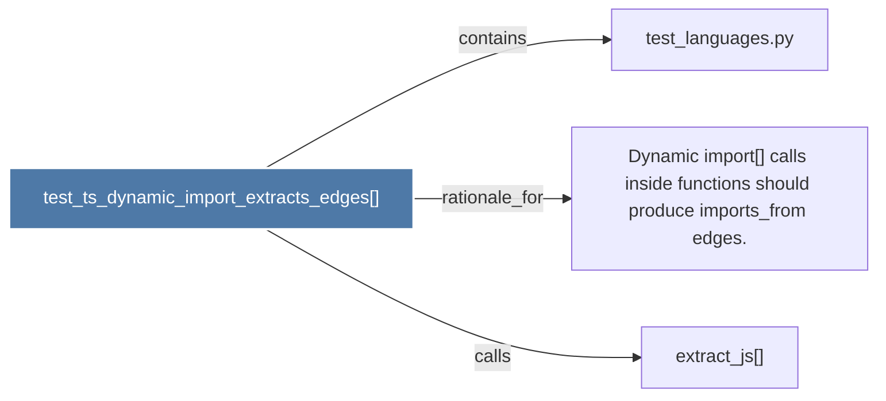

# test_ts_dynamic_import_extracts_edges()

> [!info] Properties
> **File Type**: code
> **Community**: [[_COMMUNITY_Community None|Community None]]
> **Degree**: 3

## Architecture Graph


## Outbound Connections
- [[Dynamic import() calls inside functions should produce imports_from edges.]] - `rationale_for` [EXTRACTED]
- [[extract_js()]] - `calls` [INFERRED]
- [[test_languages.py]] - `contains` [EXTRACTED]

## Inbound Dependencies
> [!abstract]- Files that link here
```dataview
LIST
FROM [[test_ts_dynamic_import_extracts_edges()]]
```

#graphify/code #graphify/EXTRACTED #community/Community_None