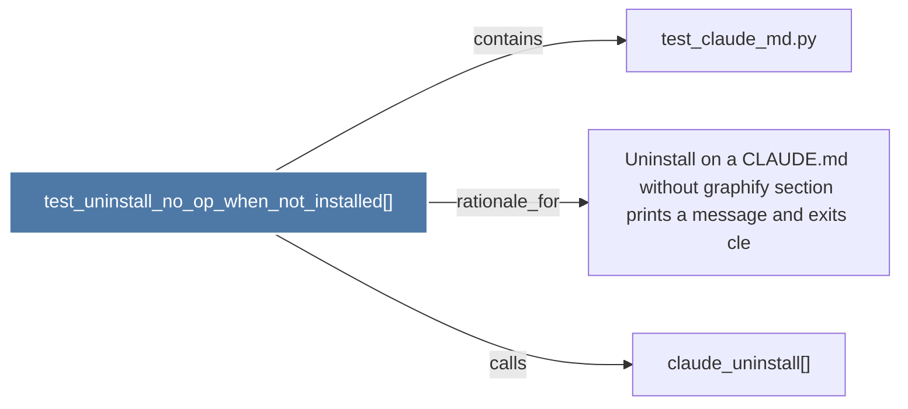

# test_uninstall_no_op_when_not_installed()

> [!info] Properties
> **File Type**: code
> **Community**: [[_COMMUNITY_Community None|Community None]]
> **Degree**: 3

## Architecture Graph


## Outbound Connections
- [[Uninstall on a CLAUDE.md without graphify section prints a message and exits cle]] - `rationale_for` [EXTRACTED]
- [[claude_uninstall()]] - `calls` [INFERRED]
- [[test_claude_md.py]] - `contains` [EXTRACTED]

## Inbound Dependencies
> [!abstract]- Files that link here
```dataview
LIST
FROM [[test_uninstall_no_op_when_not_installed()]]
```

#graphify/code #graphify/EXTRACTED #community/Community_None