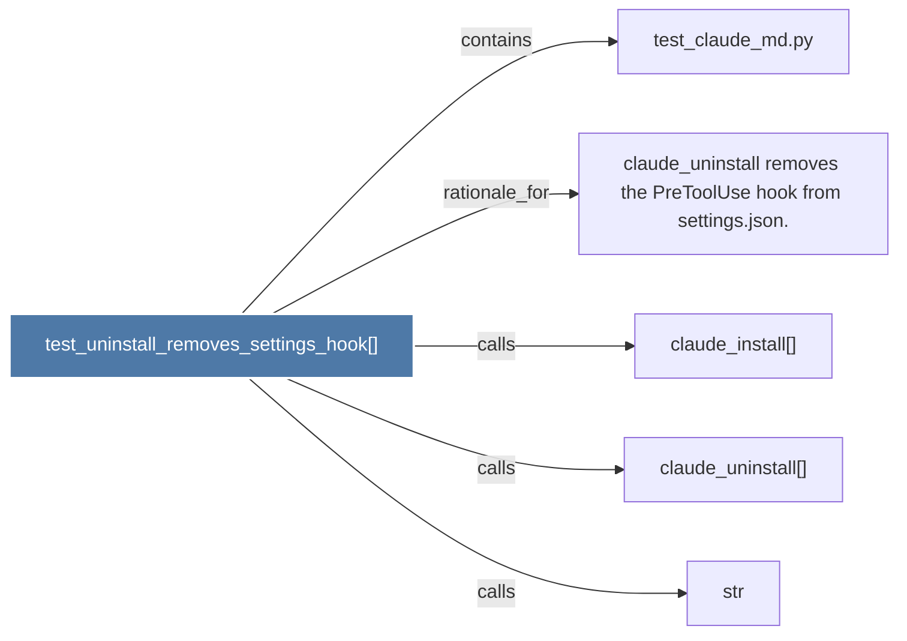

# test_uninstall_removes_settings_hook()

> [!info] Properties
> **File Type**: code
> **Community**: [[_COMMUNITY_Community None|Community None]]
> **Degree**: 5

## Architecture Graph


## Outbound Connections
- [[claude_install()]] - `calls` [INFERRED]
- [[claude_uninstall removes the PreToolUse hook from settings.json.]] - `rationale_for` [EXTRACTED]
- [[claude_uninstall()]] - `calls` [INFERRED]
- [[str]] - `calls` [INFERRED]
- [[test_claude_md.py]] - `contains` [EXTRACTED]

## Inbound Dependencies
> [!abstract]- Files that link here
```dataview
LIST
FROM [[test_uninstall_removes_settings_hook()]]
```

#graphify/code #graphify/INFERRED #community/Community_None