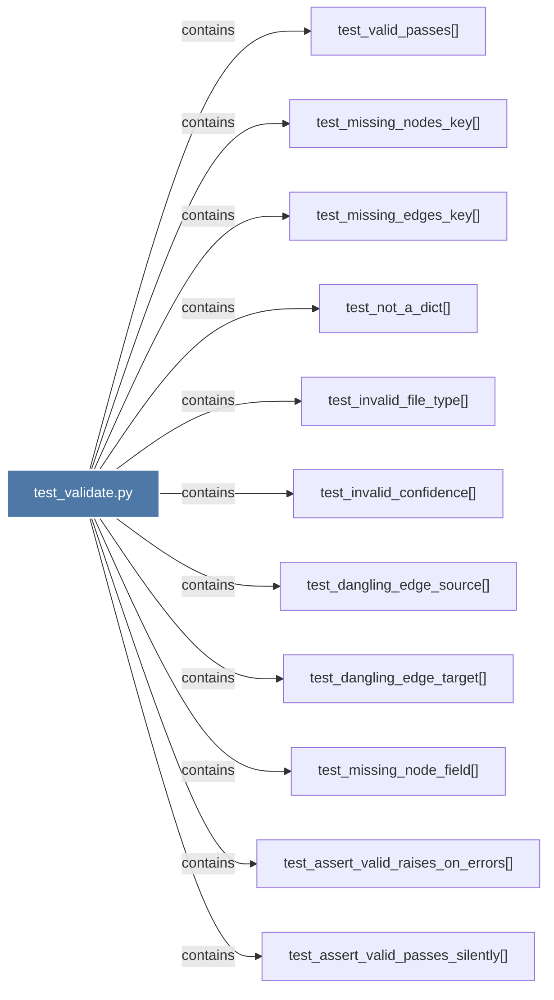

# test_validate.py

> [!info] Properties
> **File Type**: code
> **Community**: [[_COMMUNITY_Community None|Community None]]
> **Degree**: 11

## Architecture Graph


## Outbound Connections
- [[test_assert_valid_passes_silently()]] - `contains` [EXTRACTED]
- [[test_assert_valid_raises_on_errors()]] - `contains` [EXTRACTED]
- [[test_dangling_edge_source()]] - `contains` [EXTRACTED]
- [[test_dangling_edge_target()]] - `contains` [EXTRACTED]
- [[test_invalid_confidence()]] - `contains` [EXTRACTED]
- [[test_invalid_file_type()]] - `contains` [EXTRACTED]
- [[test_missing_edges_key()]] - `contains` [EXTRACTED]
- [[test_missing_node_field()]] - `contains` [EXTRACTED]
- [[test_missing_nodes_key()]] - `contains` [EXTRACTED]
- [[test_not_a_dict()]] - `contains` [EXTRACTED]
- [[test_valid_passes()]] - `contains` [EXTRACTED]

## Inbound Dependencies
> [!abstract]- Files that link here
```dataview
LIST
FROM [[test_validate.py]]
```

#graphify/code #graphify/EXTRACTED #community/Community_None