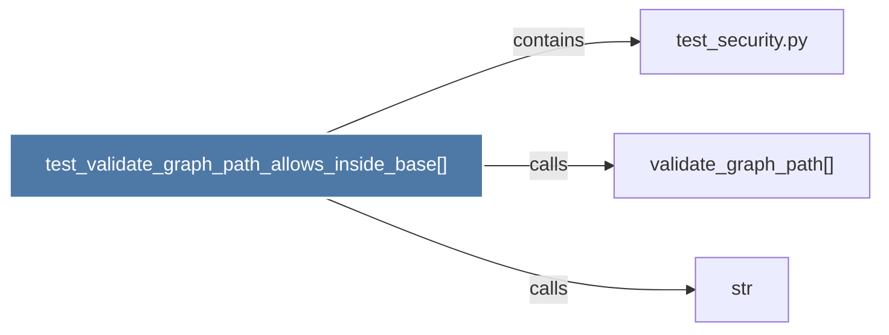

# test_validate_graph_path_allows_inside_base()

> [!info] Properties
> **File Type**: code
> **Community**: [[_COMMUNITY_Community None|Community None]]
> **Degree**: 3

## Architecture Graph


## Outbound Connections
- [[str]] - `calls` [INFERRED]
- [[test_security.py]] - `contains` [EXTRACTED]
- [[validate_graph_path()]] - `calls` [INFERRED]

## Inbound Dependencies
> [!abstract]- Files that link here
```dataview
LIST
FROM [[test_validate_graph_path_allows_inside_base()]]
```

#graphify/code #graphify/INFERRED #community/Community_None