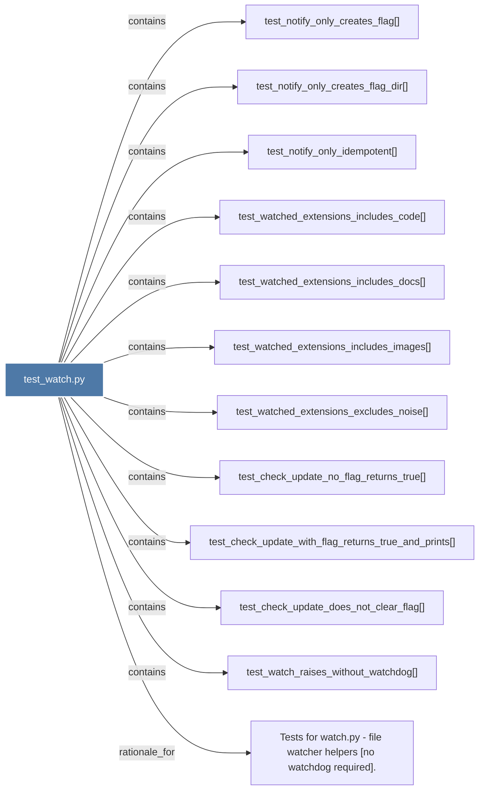

# test_watch.py

> [!info] Properties
> **File Type**: code
> **Community**: [[_COMMUNITY_Community None|Community None]]
> **Degree**: 12

## Architecture Graph


## Outbound Connections
- [[Tests for watch.py - file watcher helpers (no watchdog required).]] - `rationale_for` [EXTRACTED]
- [[test_check_update_does_not_clear_flag()]] - `contains` [EXTRACTED]
- [[test_check_update_no_flag_returns_true()]] - `contains` [EXTRACTED]
- [[test_check_update_with_flag_returns_true_and_prints()]] - `contains` [EXTRACTED]
- [[test_notify_only_creates_flag()]] - `contains` [EXTRACTED]
- [[test_notify_only_creates_flag_dir()]] - `contains` [EXTRACTED]
- [[test_notify_only_idempotent()]] - `contains` [EXTRACTED]
- [[test_watch_raises_without_watchdog()]] - `contains` [EXTRACTED]
- [[test_watched_extensions_excludes_noise()]] - `contains` [EXTRACTED]
- [[test_watched_extensions_includes_code()]] - `contains` [EXTRACTED]
- [[test_watched_extensions_includes_docs()]] - `contains` [EXTRACTED]
- [[test_watched_extensions_includes_images()]] - `contains` [EXTRACTED]

## Inbound Dependencies
> [!abstract]- Files that link here
```dataview
LIST
FROM [[test_watch.py]]
```

#graphify/code #graphify/EXTRACTED #community/Community_None