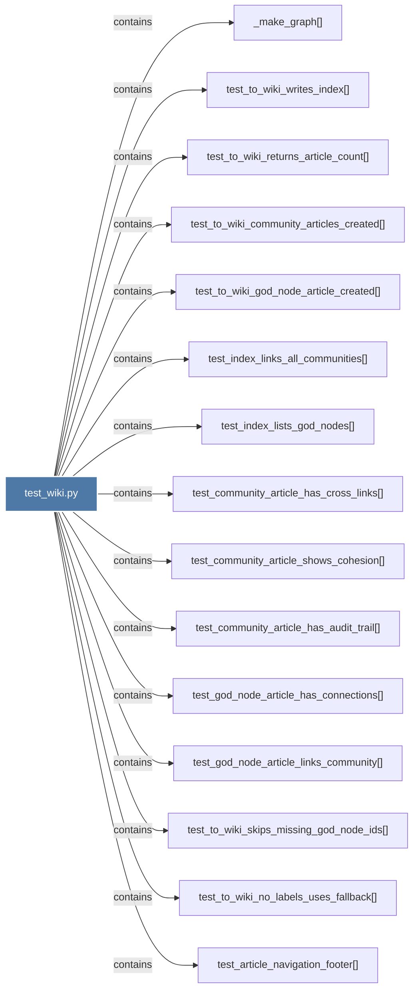

# test_wiki.py

> [!info] Properties
> **File Type**: code
> **Community**: [[_COMMUNITY_Community None|Community None]]
> **Degree**: 17

## Architecture Graph


## Outbound Connections
- [[Tests for graphify.wiki — Wikipedia-style article generation.]] - `rationale_for` [EXTRACTED]
- [[_make_graph()_2]] - `contains` [EXTRACTED]
- [[test_article_navigation_footer()]] - `contains` [EXTRACTED]
- [[test_community_article_has_audit_trail()]] - `contains` [EXTRACTED]
- [[test_community_article_has_cross_links()]] - `contains` [EXTRACTED]
- [[test_community_article_shows_cohesion()]] - `contains` [EXTRACTED]
- [[test_community_article_truncation_notice()]] - `contains` [EXTRACTED]
- [[test_god_node_article_has_connections()]] - `contains` [EXTRACTED]
- [[test_god_node_article_links_community()]] - `contains` [EXTRACTED]
- [[test_index_links_all_communities()]] - `contains` [EXTRACTED]
- [[test_index_lists_god_nodes()]] - `contains` [EXTRACTED]
- [[test_to_wiki_community_articles_created()]] - `contains` [EXTRACTED]
- [[test_to_wiki_god_node_article_created()]] - `contains` [EXTRACTED]
- [[test_to_wiki_no_labels_uses_fallback()]] - `contains` [EXTRACTED]
- [[test_to_wiki_returns_article_count()]] - `contains` [EXTRACTED]
- [[test_to_wiki_skips_missing_god_node_ids()]] - `contains` [EXTRACTED]
- [[test_to_wiki_writes_index()]] - `contains` [EXTRACTED]

## Inbound Dependencies
> [!abstract]- Files that link here
```dataview
LIST
FROM [[test_wiki.py]]
```

#graphify/code #graphify/EXTRACTED #community/Community_None