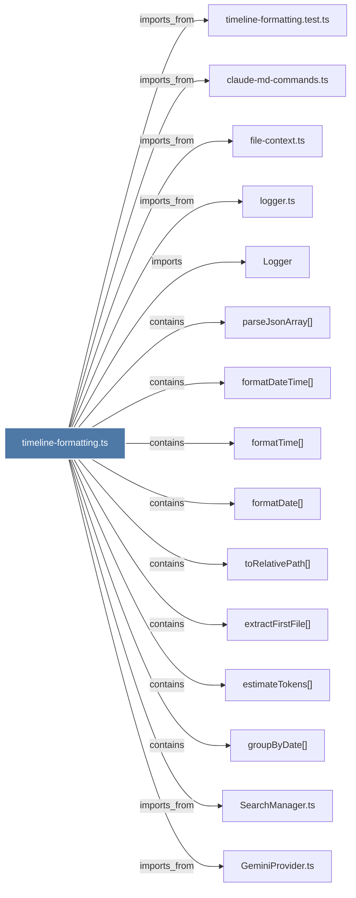

# timeline-formatting.ts

> [!info] Properties
> **File Type**: code
> **Community**: [[_COMMUNITY_Community None|Community None]]
> **Degree**: 21

## Architecture Graph


## Outbound Connections
- [[GeminiProvider.ts]] - `imports_from` [EXTRACTED]
- [[Logger]] - `imports` [EXTRACTED]
- [[ResultFormatter.ts]] - `imports_from` [EXTRACTED]
- [[SearchManager.ts]] - `imports_from` [EXTRACTED]
- [[SearchRoutes.ts]] - `imports_from` [EXTRACTED]
- [[TimelineBuilder.ts]] - `imports_from` [EXTRACTED]
- [[TimelineRenderer.ts]] - `imports_from` [EXTRACTED]
- [[claude-md-commands.ts]] - `imports_from` [EXTRACTED]
- [[claude-md-utils.ts]] - `imports_from` [EXTRACTED]
- [[estimateTokens()_1]] - `contains` [EXTRACTED]
- [[extractFirstFile()]] - `contains` [EXTRACTED]
- [[file-context.ts]] - `imports_from` [EXTRACTED]
- [[formatDate()_1]] - `contains` [EXTRACTED]
- [[formatDateTime()]] - `contains` [EXTRACTED]
- [[formatTime()_1]] - `contains` [EXTRACTED]
- [[groupByDate()]] - `contains` [EXTRACTED]
- [[logger.ts]] - `imports_from` [EXTRACTED]
- [[parseJsonArray()]] - `contains` [EXTRACTED]
- [[regenerate-claude-md.ts]] - `imports_from` [EXTRACTED]
- [[timeline-formatting.test.ts]] - `imports_from` [EXTRACTED]
- [[toRelativePath()]] - `contains` [EXTRACTED]

## Inbound Dependencies
> [!abstract]- Files that link here
```dataview
LIST
FROM [[timeline-formatting.ts]]
```

#graphify/code #graphify/EXTRACTED #community/Community_None