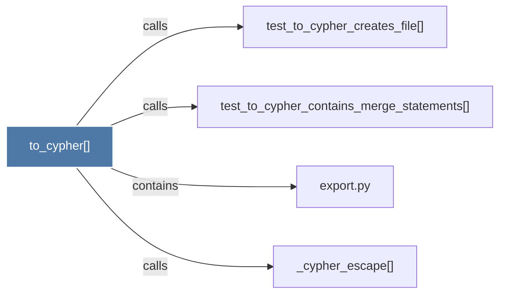

# to_cypher()

> [!info] Properties
> **File Type**: code
> **Community**: [[_COMMUNITY_Community None|Community None]]
> **Degree**: 4

## Architecture Graph


## Outbound Connections
- [[_cypher_escape()]] - `calls` [EXTRACTED]
- [[export.py]] - `contains` [EXTRACTED]
- [[test_to_cypher_contains_merge_statements()]] - `calls` [INFERRED]
- [[test_to_cypher_creates_file()]] - `calls` [INFERRED]

## Inbound Dependencies
> [!abstract]- Files that link here
```dataview
LIST
FROM [[to_cypher()]]
```

#graphify/code #graphify/INFERRED #community/Community_None