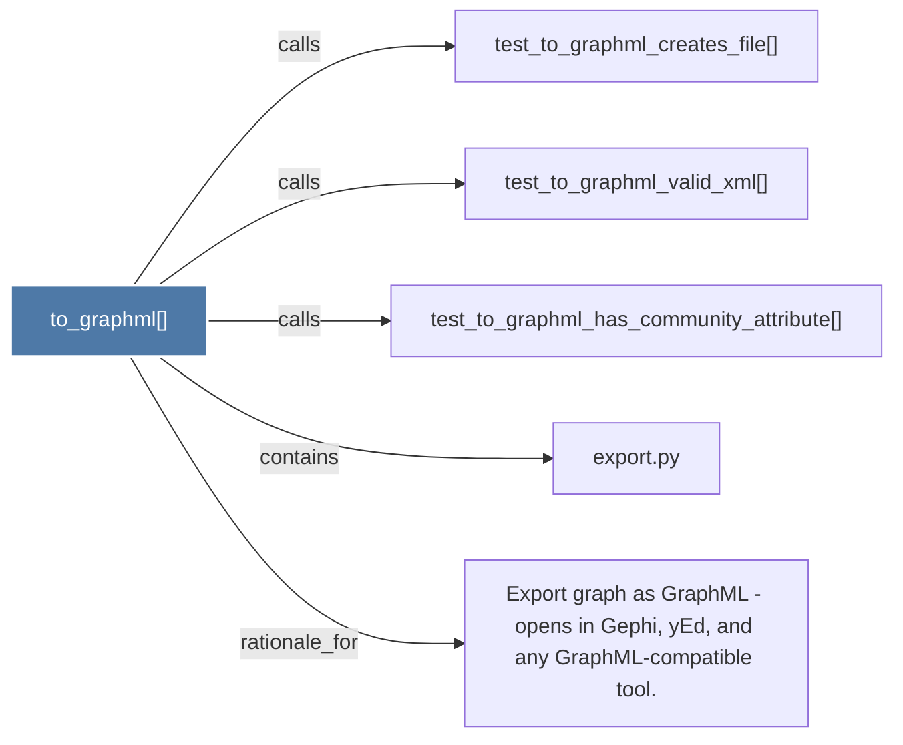

# to_graphml()

> [!info] Properties
> **File Type**: code
> **Community**: [[_COMMUNITY_Community None|Community None]]
> **Degree**: 5

## Architecture Graph


## Outbound Connections
- [[Export graph as GraphML - opens in Gephi, yEd, and any GraphML-compatible tool.]] - `rationale_for` [EXTRACTED]
- [[export.py]] - `contains` [EXTRACTED]
- [[test_to_graphml_creates_file()]] - `calls` [INFERRED]
- [[test_to_graphml_has_community_attribute()]] - `calls` [INFERRED]
- [[test_to_graphml_valid_xml()]] - `calls` [INFERRED]

## Inbound Dependencies
> [!abstract]- Files that link here
```dataview
LIST
FROM [[to_graphml()]]
```

#graphify/code #graphify/INFERRED #community/Community_None