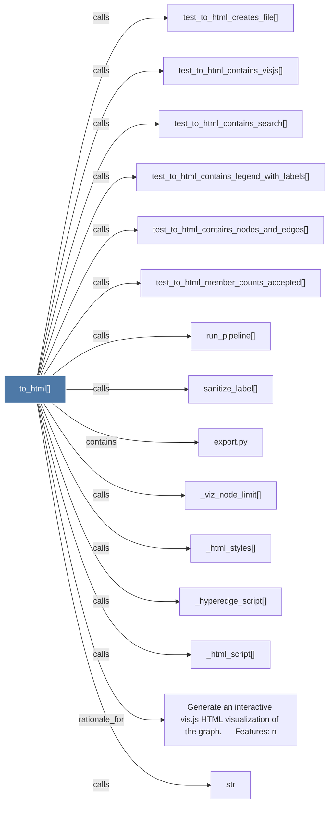

# to_html()

> [!info] Properties
> **File Type**: code
> **Community**: [[_COMMUNITY_Community None|Community None]]
> **Degree**: 17

## Architecture Graph


## Outbound Connections
- [[Generate an interactive vis.js HTML visualization of the graph.      Features n]] - `rationale_for` [EXTRACTED]
- [[_html_script()]] - `calls` [EXTRACTED]
- [[_html_styles()]] - `calls` [EXTRACTED]
- [[_hyperedge_script()]] - `calls` [EXTRACTED]
- [[_rebuild_code()]] - `calls` [INFERRED]
- [[_viz_node_limit()]] - `calls` [EXTRACTED]
- [[export.py]] - `contains` [EXTRACTED]
- [[main()_2]] - `calls` [INFERRED]
- [[run_pipeline()]] - `calls` [INFERRED]
- [[sanitize_label()]] - `calls` [INFERRED]
- [[str]] - `calls` [INFERRED]
- [[test_to_html_contains_legend_with_labels()]] - `calls` [INFERRED]
- [[test_to_html_contains_nodes_and_edges()]] - `calls` [INFERRED]
- [[test_to_html_contains_search()]] - `calls` [INFERRED]
- [[test_to_html_contains_visjs()]] - `calls` [INFERRED]
- [[test_to_html_creates_file()]] - `calls` [INFERRED]
- [[test_to_html_member_counts_accepted()]] - `calls` [INFERRED]

## Inbound Dependencies
> [!abstract]- Files that link here
```dataview
LIST
FROM [[to_html()]]
```

#graphify/code #graphify/INFERRED #community/Community_None