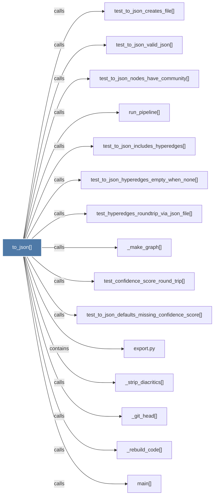

# to_json()

> [!info] Properties
> **File Type**: code
> **Community**: [[_COMMUNITY_Community None|Community None]]
> **Degree**: 15

## Architecture Graph


## Outbound Connections
- [[_git_head()]] - `calls` [EXTRACTED]
- [[_make_graph()_3]] - `calls` [INFERRED]
- [[_rebuild_code()]] - `calls` [INFERRED]
- [[_strip_diacritics()]] - `calls` [EXTRACTED]
- [[export.py]] - `contains` [EXTRACTED]
- [[main()_2]] - `calls` [INFERRED]
- [[run_pipeline()]] - `calls` [INFERRED]
- [[test_confidence_score_round_trip()]] - `calls` [INFERRED]
- [[test_hyperedges_roundtrip_via_json_file()]] - `calls` [INFERRED]
- [[test_to_json_creates_file()]] - `calls` [INFERRED]
- [[test_to_json_defaults_missing_confidence_score()]] - `calls` [INFERRED]
- [[test_to_json_hyperedges_empty_when_none()]] - `calls` [INFERRED]
- [[test_to_json_includes_hyperedges()]] - `calls` [INFERRED]
- [[test_to_json_nodes_have_community()]] - `calls` [INFERRED]
- [[test_to_json_valid_json()]] - `calls` [INFERRED]

## Inbound Dependencies
> [!abstract]- Files that link here
```dataview
LIST
FROM [[to_json()]]
```

#graphify/code #graphify/INFERRED #community/Community_None