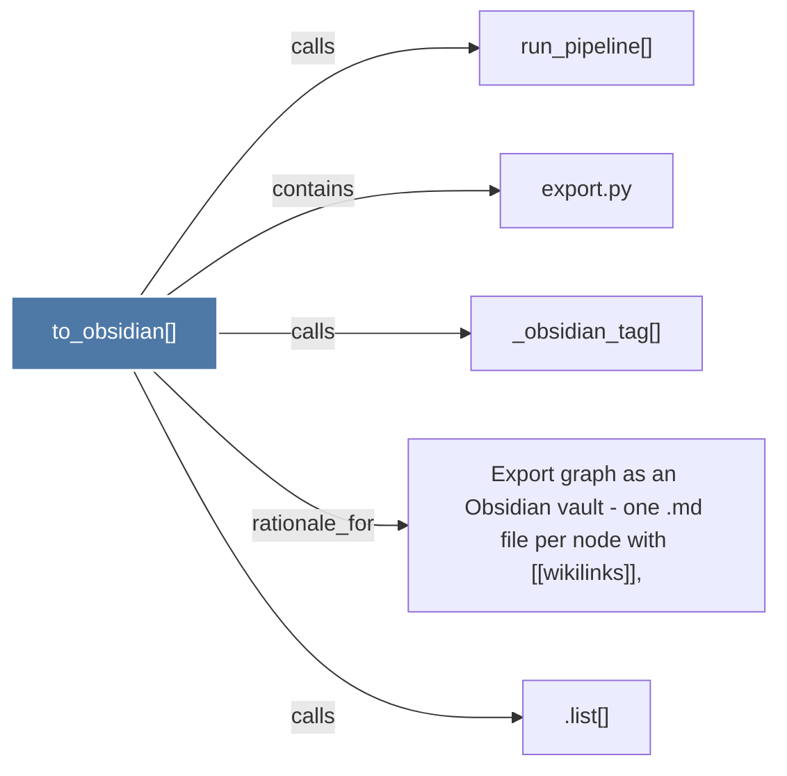

# to_obsidian()

> [!info] Properties
> **File Type**: code
> **Community**: [[_COMMUNITY_Community None|Community None]]
> **Degree**: 5

## Architecture Graph


## Outbound Connections
- [[.list()]] - `calls` [INFERRED]
- [[Export graph as an Obsidian vault - one .md file per node with wikilinks,]] - `rationale_for` [EXTRACTED]
- [[_obsidian_tag()]] - `calls` [EXTRACTED]
- [[export.py]] - `contains` [EXTRACTED]
- [[run_pipeline()]] - `calls` [INFERRED]

## Inbound Dependencies
> [!abstract]- Files that link here
```dataview
LIST
FROM [[to_obsidian()]]
```

#graphify/code #graphify/EXTRACTED #community/Community_None