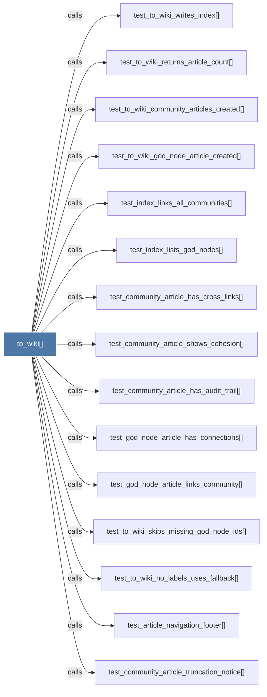

# to_wiki()

> [!info] Properties
> **File Type**: code
> **Community**: [[_COMMUNITY_Community None|Community None]]
> **Degree**: 21

## Architecture Graph


## Outbound Connections
- [[Generate a Wikipedia-style wiki from the graph.      Writes       - index]] - `rationale_for` [EXTRACTED]
- [[_community_article()]] - `calls` [EXTRACTED]
- [[_god_node_article()]] - `calls` [EXTRACTED]
- [[_index_md()]] - `calls` [EXTRACTED]
- [[_safe_filename()]] - `calls` [EXTRACTED]
- [[test_article_navigation_footer()]] - `calls` [INFERRED]
- [[test_community_article_has_audit_trail()]] - `calls` [INFERRED]
- [[test_community_article_has_cross_links()]] - `calls` [INFERRED]
- [[test_community_article_shows_cohesion()]] - `calls` [INFERRED]
- [[test_community_article_truncation_notice()]] - `calls` [INFERRED]
- [[test_god_node_article_has_connections()]] - `calls` [INFERRED]
- [[test_god_node_article_links_community()]] - `calls` [INFERRED]
- [[test_index_links_all_communities()]] - `calls` [INFERRED]
- [[test_index_lists_god_nodes()]] - `calls` [INFERRED]
- [[test_to_wiki_community_articles_created()]] - `calls` [INFERRED]
- [[test_to_wiki_god_node_article_created()]] - `calls` [INFERRED]
- [[test_to_wiki_no_labels_uses_fallback()]] - `calls` [INFERRED]
- [[test_to_wiki_returns_article_count()]] - `calls` [INFERRED]
- [[test_to_wiki_skips_missing_god_node_ids()]] - `calls` [INFERRED]
- [[test_to_wiki_writes_index()]] - `calls` [INFERRED]
- [[wiki.py]] - `contains` [EXTRACTED]

## Inbound Dependencies
> [!abstract]- Files that link here
```dataview
LIST
FROM [[to_wiki()]]
```

#graphify/code #graphify/INFERRED #community/Community_None