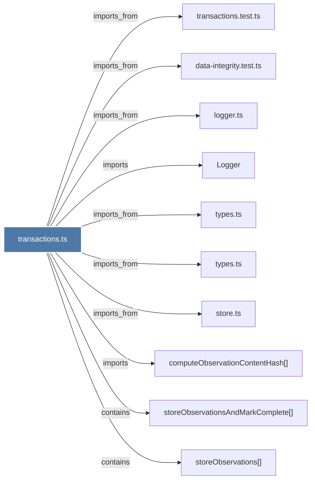

# transactions.ts

> [!info] Properties
> **File Type**: code
> **Community**: [[_COMMUNITY_Community None|Community None]]
> **Degree**: 10

## Architecture Graph


## Outbound Connections
- [[Logger]] - `imports` [EXTRACTED]
- [[computeObservationContentHash()]] - `imports` [EXTRACTED]
- [[data-integrity.test.ts]] - `imports_from` [EXTRACTED]
- [[logger.ts]] - `imports_from` [EXTRACTED]
- [[store.ts]] - `imports_from` [EXTRACTED]
- [[storeObservations()]] - `contains` [EXTRACTED]
- [[storeObservationsAndMarkComplete()]] - `contains` [EXTRACTED]
- [[transactions.test.ts]] - `imports_from` [EXTRACTED]
- [[types.ts_7]] - `imports_from` [EXTRACTED]
- [[types.ts_8]] - `imports_from` [EXTRACTED]

## Inbound Dependencies
> [!abstract]- Files that link here
```dataview
LIST
FROM [[transactions.ts]]
```

#graphify/code #graphify/EXTRACTED #community/Community_None