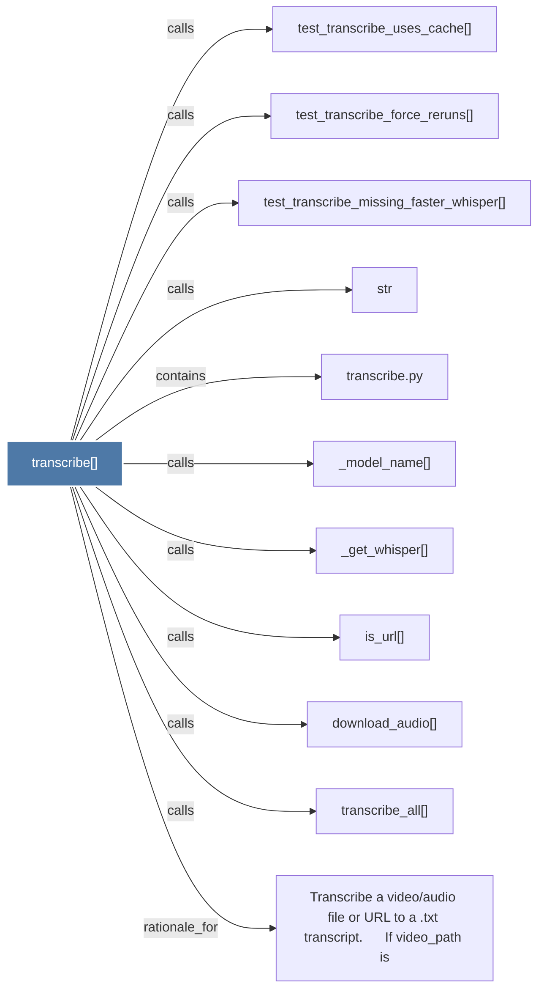

# transcribe()

> [!info] Properties
> **File Type**: code
> **Community**: [[_COMMUNITY_Community None|Community None]]
> **Degree**: 11

## Architecture Graph


## Outbound Connections
- [[Transcribe a videoaudio file or URL to a .txt transcript.      If video_path is]] - `rationale_for` [EXTRACTED]
- [[_get_whisper()]] - `calls` [EXTRACTED]
- [[_model_name()]] - `calls` [EXTRACTED]
- [[download_audio()]] - `calls` [EXTRACTED]
- [[is_url()]] - `calls` [EXTRACTED]
- [[str]] - `calls` [INFERRED]
- [[test_transcribe_force_reruns()]] - `calls` [INFERRED]
- [[test_transcribe_missing_faster_whisper()]] - `calls` [INFERRED]
- [[test_transcribe_uses_cache()]] - `calls` [INFERRED]
- [[transcribe.py]] - `contains` [EXTRACTED]
- [[transcribe_all()]] - `calls` [EXTRACTED]

## Inbound Dependencies
> [!abstract]- Files that link here
```dataview
LIST
FROM [[transcribe()]]
```

#graphify/code #graphify/EXTRACTED #community/Community_None