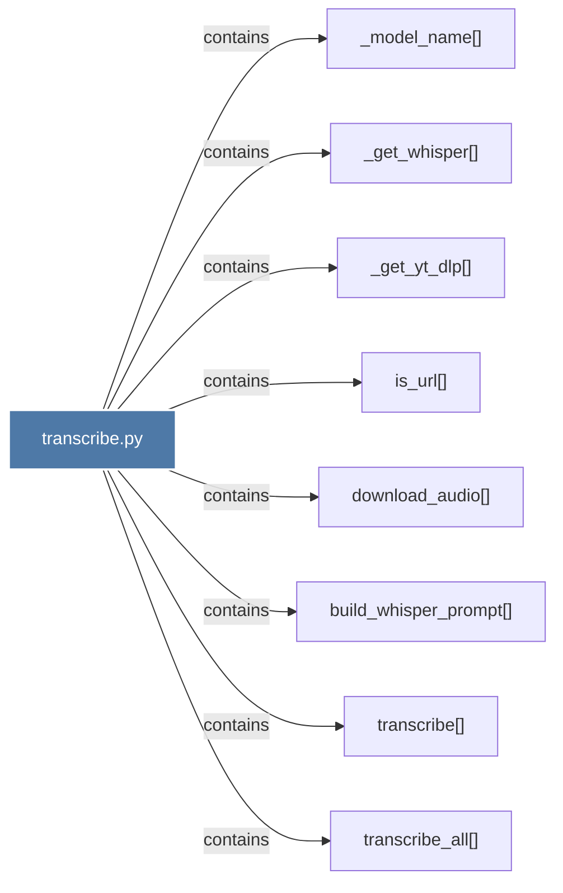

# transcribe.py

> [!info] Properties
> **File Type**: code
> **Community**: [[_COMMUNITY_Community None|Community None]]
> **Degree**: 8

## Architecture Graph


## Outbound Connections
- [[_get_whisper()]] - `contains` [EXTRACTED]
- [[_get_yt_dlp()]] - `contains` [EXTRACTED]
- [[_model_name()]] - `contains` [EXTRACTED]
- [[build_whisper_prompt()]] - `contains` [EXTRACTED]
- [[download_audio()]] - `contains` [EXTRACTED]
- [[is_url()]] - `contains` [EXTRACTED]
- [[transcribe()]] - `contains` [EXTRACTED]
- [[transcribe_all()]] - `contains` [EXTRACTED]

## Inbound Dependencies
> [!abstract]- Files that link here
```dataview
LIST
FROM [[transcribe.py]]
```

#graphify/code #graphify/EXTRACTED #community/Community_None