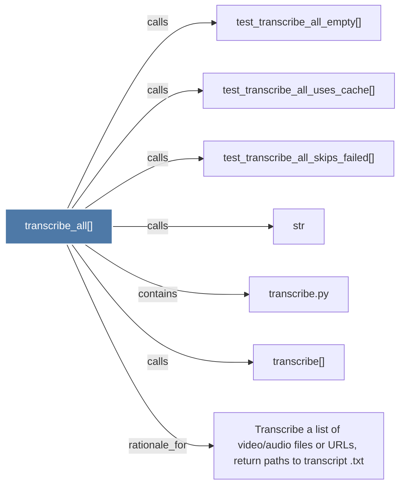

# transcribe_all()

> [!info] Properties
> **File Type**: code
> **Community**: [[_COMMUNITY_Community None|Community None]]
> **Degree**: 7

## Architecture Graph


## Outbound Connections
- [[Transcribe a list of videoaudio files or URLs, return paths to transcript .txt]] - `rationale_for` [EXTRACTED]
- [[str]] - `calls` [INFERRED]
- [[test_transcribe_all_empty()]] - `calls` [INFERRED]
- [[test_transcribe_all_skips_failed()]] - `calls` [INFERRED]
- [[test_transcribe_all_uses_cache()]] - `calls` [INFERRED]
- [[transcribe()]] - `calls` [EXTRACTED]
- [[transcribe.py]] - `contains` [EXTRACTED]

## Inbound Dependencies
> [!abstract]- Files that link here
```dataview
LIST
FROM [[transcribe_all()]]
```

#graphify/code #graphify/INFERRED #community/Community_None