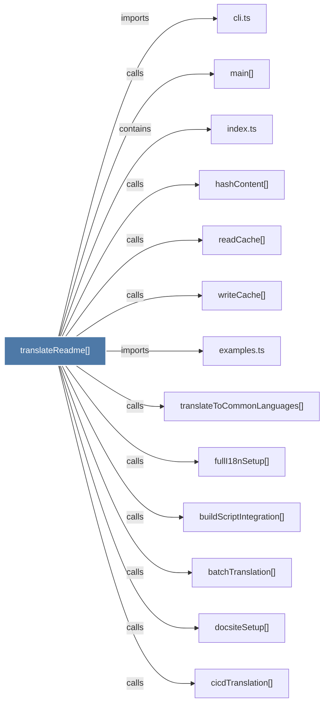

# translateReadme()

> [!info] Properties
> **File Type**: code
> **Community**: [[_COMMUNITY_Community None|Community None]]
> **Degree**: 13

## Architecture Graph


## Outbound Connections
- [[batchTranslation()]] - `calls` [INFERRED]
- [[buildScriptIntegration()]] - `calls` [INFERRED]
- [[cicdTranslation()]] - `calls` [INFERRED]
- [[cli.ts_2]] - `imports` [EXTRACTED]
- [[docsiteSetup()]] - `calls` [INFERRED]
- [[examples.ts]] - `imports` [EXTRACTED]
- [[fullI18nSetup()]] - `calls` [INFERRED]
- [[hashContent()]] - `calls` [EXTRACTED]
- [[index.ts_14]] - `contains` [EXTRACTED]
- [[main()_43]] - `calls` [INFERRED]
- [[readCache()]] - `calls` [EXTRACTED]
- [[translateToCommonLanguages()]] - `calls` [INFERRED]
- [[writeCache()]] - `calls` [EXTRACTED]

## Inbound Dependencies
> [!abstract]- Files that link here
```dataview
LIST
FROM [[translateReadme()]]
```

#graphify/code #graphify/INFERRED #community/Community_None