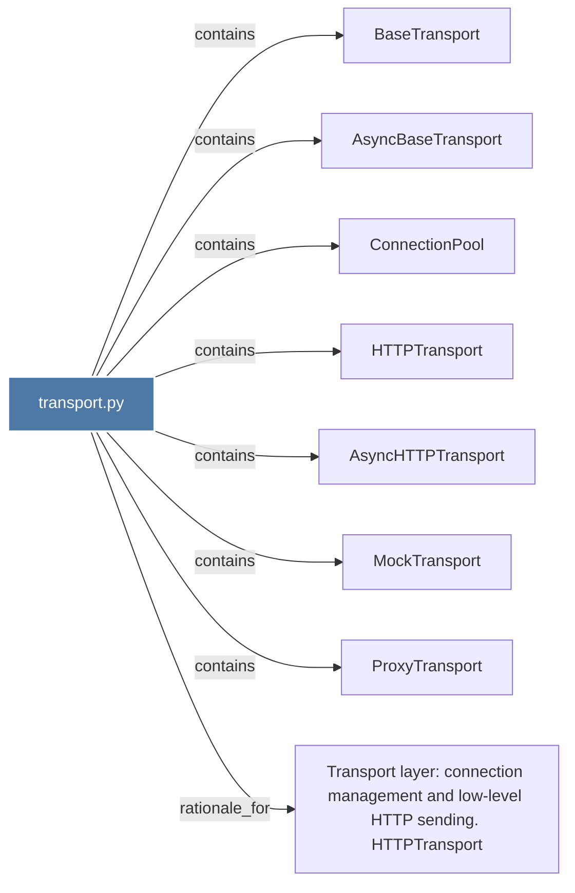

# transport.py

> [!info] Properties
> **File Type**: code
> **Community**: [[_COMMUNITY_Community None|Community None]]
> **Degree**: 8

## Architecture Graph


## Outbound Connections
- [[AsyncBaseTransport]] - `contains` [EXTRACTED]
- [[AsyncHTTPTransport]] - `contains` [EXTRACTED]
- [[BaseTransport]] - `contains` [EXTRACTED]
- [[ConnectionPool]] - `contains` [EXTRACTED]
- [[HTTPTransport]] - `contains` [EXTRACTED]
- [[MockTransport]] - `contains` [EXTRACTED]
- [[ProxyTransport]] - `contains` [EXTRACTED]
- [[Transport layer connection management and low-level HTTP sending. HTTPTransport]] - `rationale_for` [EXTRACTED]

## Inbound Dependencies
> [!abstract]- Files that link here
```dataview
LIST
FROM [[transport.py]]
```

#graphify/code #graphify/EXTRACTED #community/Community_None