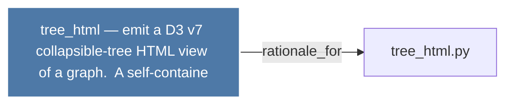

# tree_html — emit a D3 v7 collapsible-tree HTML view of a graph.  A self-containe

> [!info] Properties
> **File Type**: rationale
> **Community**: [[_COMMUNITY_Community None|Community None]]
> **Degree**: 1

## Architecture Graph


## Outbound Connections
- [[tree_html.py]] - `rationale_for` [EXTRACTED]

## Inbound Dependencies
> [!abstract]- Files that link here
```dataview
LIST
FROM [[tree_html — emit a D3 v7 collapsible-tree HTML view of a graph.  A self-containe]]
```

#graphify/rationale #graphify/EXTRACTED #community/Community_None