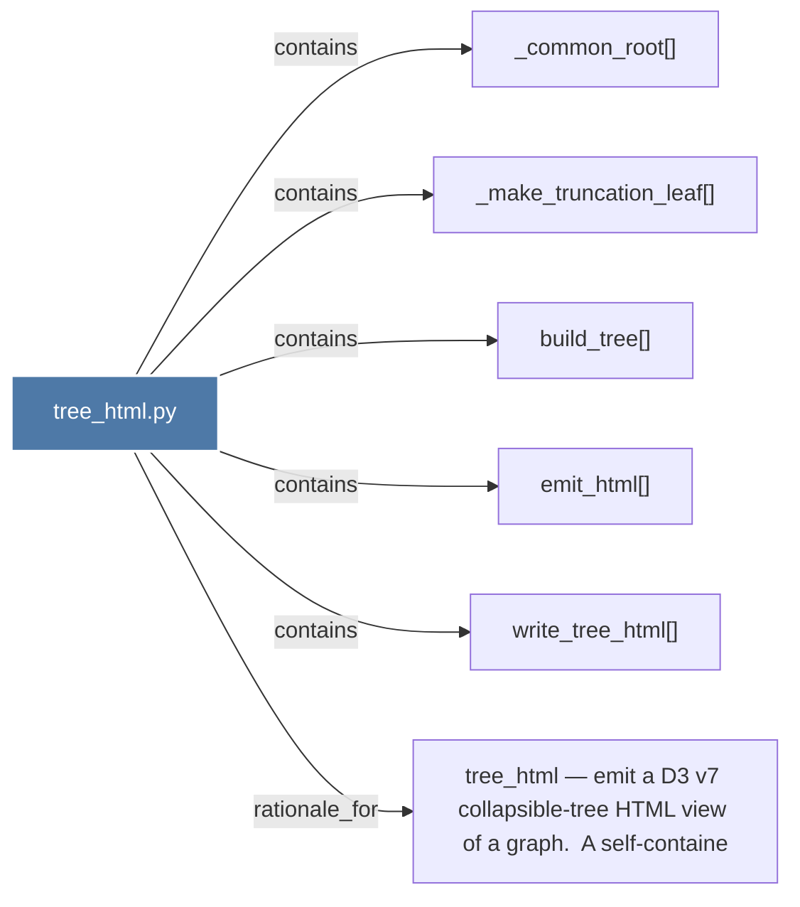

# tree_html.py

> [!info] Properties
> **File Type**: code
> **Community**: [[_COMMUNITY_Community None|Community None]]
> **Degree**: 6

## Architecture Graph


## Outbound Connections
- [[_common_root()]] - `contains` [EXTRACTED]
- [[_make_truncation_leaf()]] - `contains` [EXTRACTED]
- [[build_tree()]] - `contains` [EXTRACTED]
- [[emit_html()]] - `contains` [EXTRACTED]
- [[tree_html — emit a D3 v7 collapsible-tree HTML view of a graph.  A self-containe]] - `rationale_for` [EXTRACTED]
- [[write_tree_html()]] - `contains` [EXTRACTED]

## Inbound Dependencies
> [!abstract]- Files that link here
```dataview
LIST
FROM [[tree_html.py]]
```

#graphify/code #graphify/EXTRACTED #community/Community_None