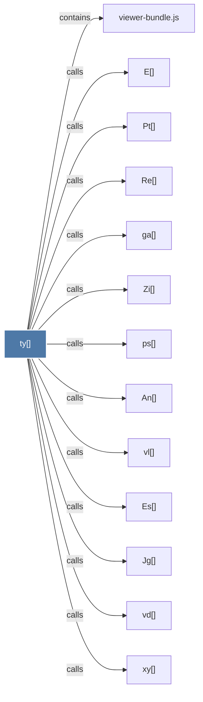

# ty()

> [!info] Properties
> **File Type**: code
> **Community**: [[_COMMUNITY_Community None|Community None]]
> **Degree**: 13

## Architecture Graph


## Outbound Connections
- [[An()]] - `calls` [EXTRACTED]
- [[E()]] - `calls` [EXTRACTED]
- [[Es()]] - `calls` [EXTRACTED]
- [[Jg()]] - `calls` [EXTRACTED]
- [[Pt()]] - `calls` [EXTRACTED]
- [[Re()]] - `calls` [EXTRACTED]
- [[Zi()]] - `calls` [EXTRACTED]
- [[ga()]] - `calls` [EXTRACTED]
- [[ps()]] - `calls` [EXTRACTED]
- [[vd()]] - `calls` [EXTRACTED]
- [[viewer-bundle.js]] - `contains` [EXTRACTED]
- [[vl()]] - `calls` [EXTRACTED]
- [[xy()]] - `calls` [EXTRACTED]

## Inbound Dependencies
> [!abstract]- Files that link here
```dataview
LIST
FROM [[ty()]]
```

#graphify/code #graphify/EXTRACTED #community/Community_None