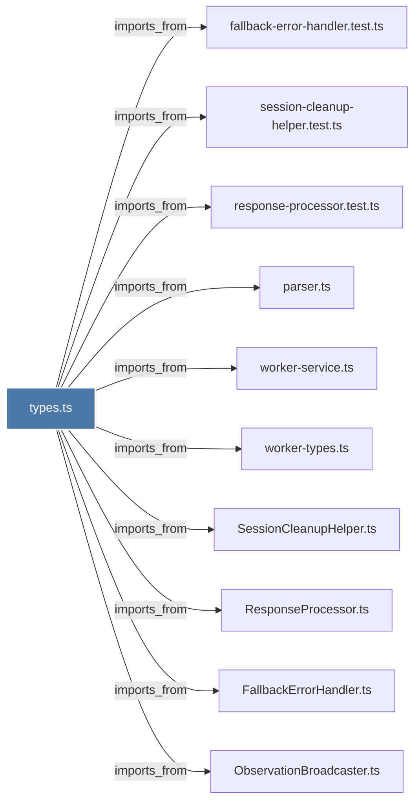

# types.ts

> [!info] Properties
> **File Type**: code
> **Community**: [[_COMMUNITY_Community None|Community None]]
> **Degree**: 10

## Architecture Graph


## Outbound Connections
- [[FallbackErrorHandler.ts]] - `imports_from` [EXTRACTED]
- [[ObservationBroadcaster.ts]] - `imports_from` [EXTRACTED]
- [[ResponseProcessor.ts]] - `imports_from` [EXTRACTED]
- [[SessionCleanupHelper.ts]] - `imports_from` [EXTRACTED]
- [[fallback-error-handler.test.ts]] - `imports_from` [EXTRACTED]
- [[parser.ts]] - `imports_from` [EXTRACTED]
- [[response-processor.test.ts]] - `imports_from` [EXTRACTED]
- [[session-cleanup-helper.test.ts]] - `imports_from` [EXTRACTED]
- [[worker-service.ts]] - `imports_from` [EXTRACTED]
- [[worker-types.ts]] - `imports_from` [EXTRACTED]

## Inbound Dependencies
> [!abstract]- Files that link here
```dataview
LIST
FROM [[types.ts_1]]
```

#graphify/code #graphify/EXTRACTED #community/Community_None