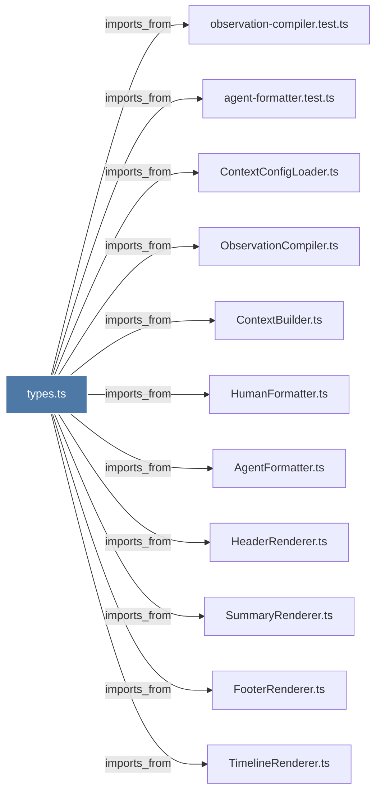

# types.ts

> [!info] Properties
> **File Type**: code
> **Community**: [[_COMMUNITY_Community None|Community None]]
> **Degree**: 11

## Architecture Graph


## Outbound Connections
- [[AgentFormatter.ts]] - `imports_from` [EXTRACTED]
- [[ContextBuilder.ts]] - `imports_from` [EXTRACTED]
- [[ContextConfigLoader.ts]] - `imports_from` [EXTRACTED]
- [[FooterRenderer.ts]] - `imports_from` [EXTRACTED]
- [[HeaderRenderer.ts]] - `imports_from` [EXTRACTED]
- [[HumanFormatter.ts]] - `imports_from` [EXTRACTED]
- [[ObservationCompiler.ts]] - `imports_from` [EXTRACTED]
- [[SummaryRenderer.ts]] - `imports_from` [EXTRACTED]
- [[TimelineRenderer.ts]] - `imports_from` [EXTRACTED]
- [[agent-formatter.test.ts]] - `imports_from` [EXTRACTED]
- [[observation-compiler.test.ts]] - `imports_from` [EXTRACTED]

## Inbound Dependencies
> [!abstract]- Files that link here
```dataview
LIST
FROM [[types.ts_12]]
```

#graphify/code #graphify/EXTRACTED #community/Community_None