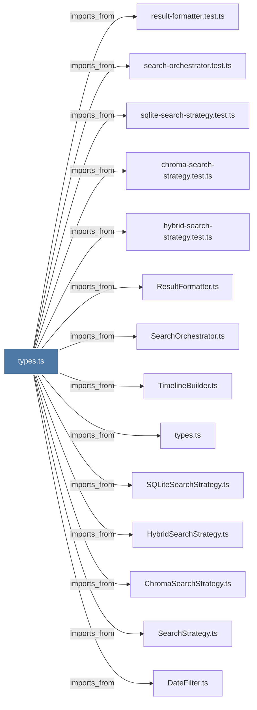

# types.ts

> [!info] Properties
> **File Type**: code
> **Community**: [[_COMMUNITY_Community None|Community None]]
> **Degree**: 14

## Architecture Graph


## Outbound Connections
- [[ChromaSearchStrategy.ts]] - `imports_from` [EXTRACTED]
- [[DateFilter.ts]] - `imports_from` [EXTRACTED]
- [[HybridSearchStrategy.ts]] - `imports_from` [EXTRACTED]
- [[ResultFormatter.ts]] - `imports_from` [EXTRACTED]
- [[SQLiteSearchStrategy.ts]] - `imports_from` [EXTRACTED]
- [[SearchOrchestrator.ts]] - `imports_from` [EXTRACTED]
- [[SearchStrategy.ts]] - `imports_from` [EXTRACTED]
- [[TimelineBuilder.ts]] - `imports_from` [EXTRACTED]
- [[chroma-search-strategy.test.ts]] - `imports_from` [EXTRACTED]
- [[hybrid-search-strategy.test.ts]] - `imports_from` [EXTRACTED]
- [[result-formatter.test.ts]] - `imports_from` [EXTRACTED]
- [[search-orchestrator.test.ts]] - `imports_from` [EXTRACTED]
- [[sqlite-search-strategy.test.ts]] - `imports_from` [EXTRACTED]
- [[types.ts_6]] - `imports_from` [EXTRACTED]

## Inbound Dependencies
> [!abstract]- Files that link here
```dataview
LIST
FROM [[types.ts_2]]
```

#graphify/code #graphify/EXTRACTED #community/Community_None