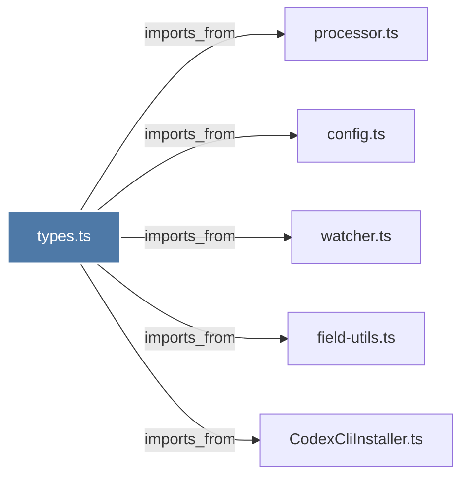

# types.ts

> [!info] Properties
> **File Type**: code
> **Community**: [[_COMMUNITY_Community None|Community None]]
> **Degree**: 5

## Architecture Graph


## Outbound Connections
- [[CodexCliInstaller.ts]] - `imports_from` [EXTRACTED]
- [[config.ts]] - `imports_from` [EXTRACTED]
- [[field-utils.ts]] - `imports_from` [EXTRACTED]
- [[processor.ts]] - `imports_from` [EXTRACTED]
- [[watcher.ts]] - `imports_from` [EXTRACTED]

## Inbound Dependencies
> [!abstract]- Files that link here
```dataview
LIST
FROM [[types.ts_4]]
```

#graphify/code #graphify/EXTRACTED #community/Community_None