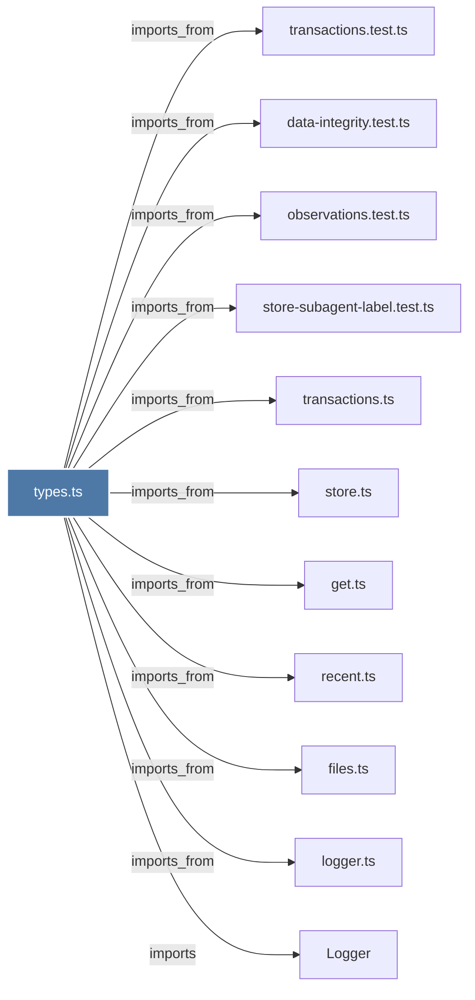

# types.ts

> [!info] Properties
> **File Type**: code
> **Community**: [[_COMMUNITY_Community None|Community None]]
> **Degree**: 11

## Architecture Graph


## Outbound Connections
- [[Logger]] - `imports` [EXTRACTED]
- [[data-integrity.test.ts]] - `imports_from` [EXTRACTED]
- [[files.ts]] - `imports_from` [EXTRACTED]
- [[get.ts]] - `imports_from` [EXTRACTED]
- [[logger.ts]] - `imports_from` [EXTRACTED]
- [[observations.test.ts]] - `imports_from` [EXTRACTED]
- [[recent.ts]] - `imports_from` [EXTRACTED]
- [[store-subagent-label.test.ts]] - `imports_from` [EXTRACTED]
- [[store.ts]] - `imports_from` [EXTRACTED]
- [[transactions.test.ts]] - `imports_from` [EXTRACTED]
- [[transactions.ts]] - `imports_from` [EXTRACTED]

## Inbound Dependencies
> [!abstract]- Files that link here
```dataview
LIST
FROM [[types.ts_7]]
```

#graphify/code #graphify/EXTRACTED #community/Community_None