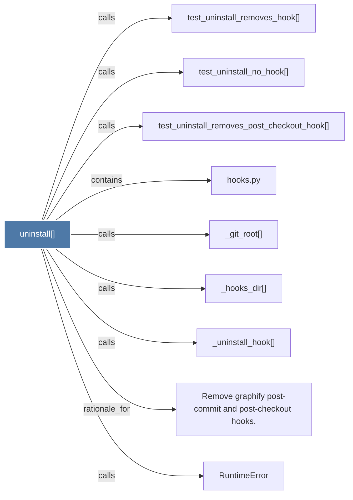

# uninstall()

> [!info] Properties
> **File Type**: code
> **Community**: [[_COMMUNITY_Community None|Community None]]
> **Degree**: 9

## Architecture Graph


## Outbound Connections
- [[Remove graphify post-commit and post-checkout hooks.]] - `rationale_for` [EXTRACTED]
- [[RuntimeError]] - `calls` [INFERRED]
- [[_git_root()]] - `calls` [EXTRACTED]
- [[_hooks_dir()]] - `calls` [EXTRACTED]
- [[_uninstall_hook()]] - `calls` [EXTRACTED]
- [[hooks.py]] - `contains` [EXTRACTED]
- [[test_uninstall_no_hook()]] - `calls` [INFERRED]
- [[test_uninstall_removes_hook()]] - `calls` [INFERRED]
- [[test_uninstall_removes_post_checkout_hook()]] - `calls` [INFERRED]

## Inbound Dependencies
> [!abstract]- Files that link here
```dataview
LIST
FROM [[uninstall()]]
```

#graphify/code #graphify/EXTRACTED #community/Community_None