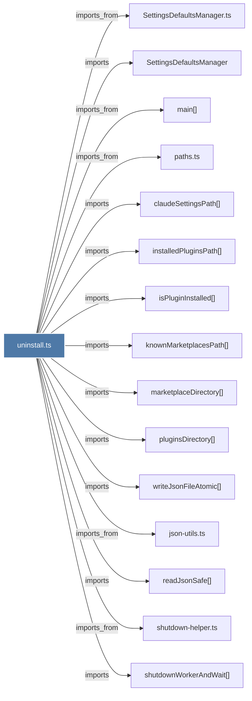

# uninstall.ts

> [!info] Properties
> **File Type**: code
> **Community**: [[_COMMUNITY_Community None|Community None]]
> **Degree**: 23

## Architecture Graph


## Outbound Connections
- [[SettingsDefaultsManager]] - `imports` [EXTRACTED]
- [[SettingsDefaultsManager.ts]] - `imports_from` [EXTRACTED]
- [[claudeSettingsPath()]] - `imports` [EXTRACTED]
- [[installedPluginsPath()]] - `imports` [EXTRACTED]
- [[isPluginInstalled()]] - `imports` [EXTRACTED]
- [[json-utils.ts]] - `imports_from` [EXTRACTED]
- [[knownMarketplacesPath()]] - `imports` [EXTRACTED]
- [[main()_21]] - `imports_from` [EXTRACTED]
- [[marketplaceDirectory()]] - `imports` [EXTRACTED]
- [[paths.ts_1]] - `imports_from` [EXTRACTED]
- [[pluginsDirectory()]] - `imports` [EXTRACTED]
- [[readJsonSafe()]] - `imports` [EXTRACTED]
- [[removeCacheDirectory()]] - `contains` [EXTRACTED]
- [[removeFromClaudeSettings()]] - `contains` [EXTRACTED]
- [[removeFromInstalledPlugins()]] - `contains` [EXTRACTED]
- [[removeFromKnownMarketplaces()]] - `contains` [EXTRACTED]
- [[removeMarketplaceDirectory()]] - `contains` [EXTRACTED]
- [[removeStrayClaudeMemPaths()]] - `contains` [EXTRACTED]
- [[runUninstallCommand()]] - `contains` [EXTRACTED]
- [[shutdown-helper.ts]] - `imports_from` [EXTRACTED]
- [[shutdownWorkerAndWait()]] - `imports` [EXTRACTED]
- [[stripLegacyClaudeMemAlias()]] - `contains` [EXTRACTED]
- [[writeJsonFileAtomic()]] - `imports` [EXTRACTED]

## Inbound Dependencies
> [!abstract]- Files that link here
```dataview
LIST
FROM [[uninstall.ts]]
```

#graphify/code #graphify/EXTRACTED #community/Community_None