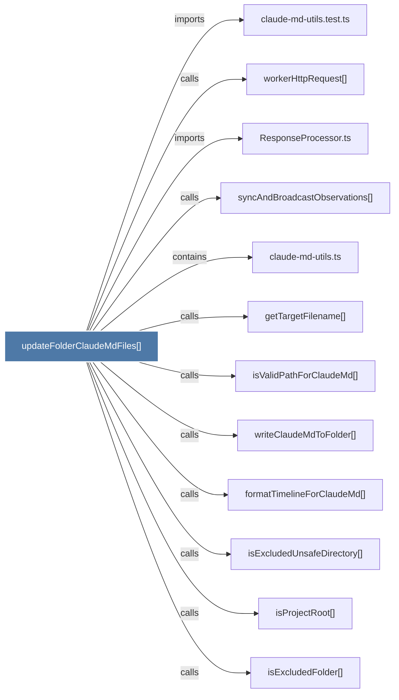

# updateFolderClaudeMdFiles()

> [!info] Properties
> **File Type**: code
> **Community**: [[_COMMUNITY_Community None|Community None]]
> **Degree**: 12

## Architecture Graph


## Outbound Connections
- [[ResponseProcessor.ts]] - `imports` [EXTRACTED]
- [[claude-md-utils.test.ts]] - `imports` [EXTRACTED]
- [[claude-md-utils.ts]] - `contains` [EXTRACTED]
- [[formatTimelineForClaudeMd()]] - `calls` [EXTRACTED]
- [[getTargetFilename()]] - `calls` [EXTRACTED]
- [[isExcludedFolder()]] - `calls` [EXTRACTED]
- [[isExcludedUnsafeDirectory()]] - `calls` [EXTRACTED]
- [[isProjectRoot()]] - `calls` [EXTRACTED]
- [[isValidPathForClaudeMd()]] - `calls` [EXTRACTED]
- [[syncAndBroadcastObservations()]] - `calls` [INFERRED]
- [[workerHttpRequest()]] - `calls` [INFERRED]
- [[writeClaudeMdToFolder()_1]] - `calls` [EXTRACTED]

## Inbound Dependencies
> [!abstract]- Files that link here
```dataview
LIST
FROM [[updateFolderClaudeMdFiles()]]
```

#graphify/code #graphify/EXTRACTED #community/Community_None