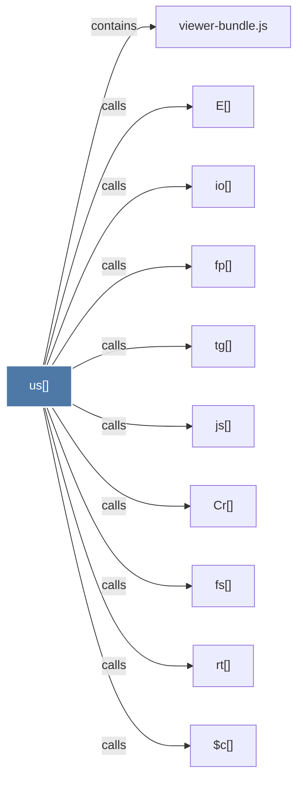

# us()

> [!info] Properties
> **File Type**: code
> **Community**: [[_COMMUNITY_Community None|Community None]]
> **Degree**: 10

## Architecture Graph


## Outbound Connections
- [[$c()]] - `calls` [EXTRACTED]
- [[Cr()]] - `calls` [EXTRACTED]
- [[E()]] - `calls` [EXTRACTED]
- [[fp()]] - `calls` [EXTRACTED]
- [[fs()]] - `calls` [EXTRACTED]
- [[io()]] - `calls` [EXTRACTED]
- [[js()]] - `calls` [EXTRACTED]
- [[rt()]] - `calls` [EXTRACTED]
- [[tg()]] - `calls` [EXTRACTED]
- [[viewer-bundle.js]] - `contains` [EXTRACTED]

## Inbound Dependencies
> [!abstract]- Files that link here
```dataview
LIST
FROM [[us()]]
```

#graphify/code #graphify/EXTRACTED #community/Community_None