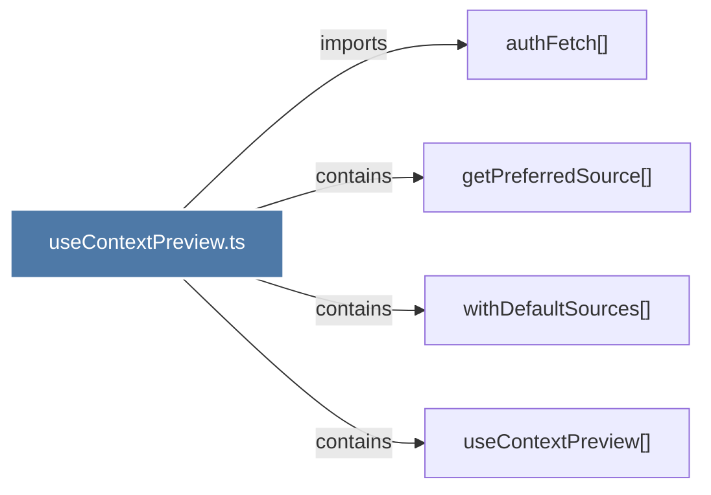

# useContextPreview.ts

> [!info] Properties
> **File Type**: code
> **Community**: [[_COMMUNITY_Community None|Community None]]
> **Degree**: 4

## Architecture Graph


## Outbound Connections
- [[authFetch()]] - `imports` [EXTRACTED]
- [[getPreferredSource()]] - `contains` [EXTRACTED]
- [[useContextPreview()]] - `contains` [EXTRACTED]
- [[withDefaultSources()]] - `contains` [EXTRACTED]

## Inbound Dependencies
> [!abstract]- Files that link here
```dataview
LIST
FROM [[useContextPreview.ts]]
```

#graphify/code #graphify/EXTRACTED #community/Community_None