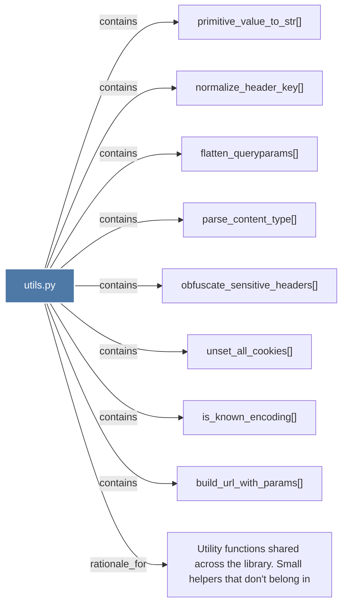

# utils.py

> [!info] Properties
> **File Type**: code
> **Community**: [[_COMMUNITY_Community None|Community None]]
> **Degree**: 9

## Architecture Graph


## Outbound Connections
- [[Utility functions shared across the library. Small helpers that don't belong in]] - `rationale_for` [EXTRACTED]
- [[build_url_with_params()]] - `contains` [EXTRACTED]
- [[flatten_queryparams()]] - `contains` [EXTRACTED]
- [[is_known_encoding()]] - `contains` [EXTRACTED]
- [[normalize_header_key()]] - `contains` [EXTRACTED]
- [[obfuscate_sensitive_headers()]] - `contains` [EXTRACTED]
- [[parse_content_type()]] - `contains` [EXTRACTED]
- [[primitive_value_to_str()]] - `contains` [EXTRACTED]
- [[unset_all_cookies()]] - `contains` [EXTRACTED]

## Inbound Dependencies
> [!abstract]- Files that link here
```dataview
LIST
FROM [[utils.py]]
```

#graphify/code #graphify/EXTRACTED #community/Community_None