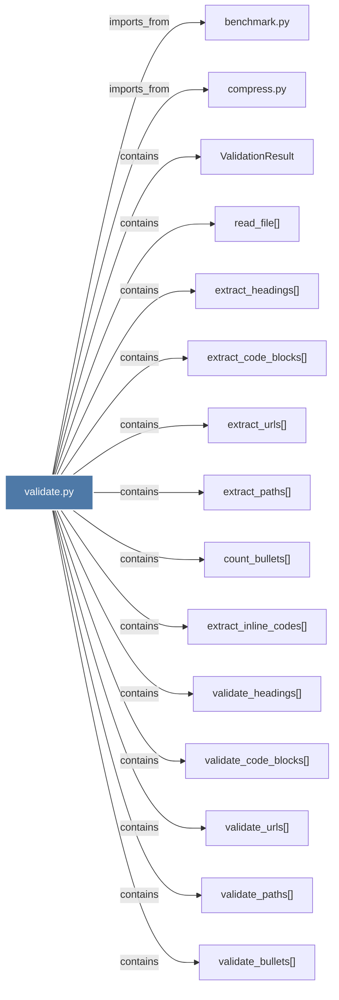

# validate.py

> [!info] Properties
> **File Type**: code
> **Community**: [[_COMMUNITY_Community None|Community None]]
> **Degree**: 17

## Architecture Graph


## Outbound Connections
- [[ValidationResult]] - `contains` [EXTRACTED]
- [[benchmark.py_1]] - `imports_from` [EXTRACTED]
- [[compress.py]] - `imports_from` [EXTRACTED]
- [[count_bullets()]] - `contains` [EXTRACTED]
- [[extract_code_blocks()]] - `contains` [EXTRACTED]
- [[extract_headings()]] - `contains` [EXTRACTED]
- [[extract_inline_codes()]] - `contains` [EXTRACTED]
- [[extract_paths()]] - `contains` [EXTRACTED]
- [[extract_urls()]] - `contains` [EXTRACTED]
- [[read_file()]] - `contains` [EXTRACTED]
- [[validate()_2]] - `contains` [EXTRACTED]
- [[validate_bullets()]] - `contains` [EXTRACTED]
- [[validate_code_blocks()]] - `contains` [EXTRACTED]
- [[validate_headings()]] - `contains` [EXTRACTED]
- [[validate_inline_codes()]] - `contains` [EXTRACTED]
- [[validate_paths()]] - `contains` [EXTRACTED]
- [[validate_urls()]] - `contains` [EXTRACTED]

## Inbound Dependencies
> [!abstract]- Files that link here
```dataview
LIST
FROM [[validate.py_1]]
```

#graphify/code #graphify/EXTRACTED #community/Community_None