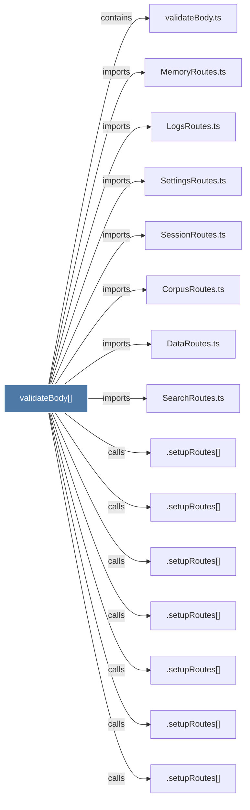

# validateBody()

> [!info] Properties
> **File Type**: code
> **Community**: [[_COMMUNITY_Community None|Community None]]
> **Degree**: 15

## Architecture Graph


## Outbound Connections
- [[.setupRoutes()_1]] - `calls` [INFERRED]
- [[.setupRoutes()_3]] - `calls` [INFERRED]
- [[.setupRoutes()_4]] - `calls` [INFERRED]
- [[.setupRoutes()_5]] - `calls` [INFERRED]
- [[.setupRoutes()_6]] - `calls` [INFERRED]
- [[.setupRoutes()_7]] - `calls` [INFERRED]
- [[.setupRoutes()_8]] - `calls` [INFERRED]
- [[CorpusRoutes.ts]] - `imports` [EXTRACTED]
- [[DataRoutes.ts]] - `imports` [EXTRACTED]
- [[LogsRoutes.ts]] - `imports` [EXTRACTED]
- [[MemoryRoutes.ts]] - `imports` [EXTRACTED]
- [[SearchRoutes.ts]] - `imports` [EXTRACTED]
- [[SessionRoutes.ts]] - `imports` [EXTRACTED]
- [[SettingsRoutes.ts]] - `imports` [EXTRACTED]
- [[validateBody.ts]] - `contains` [EXTRACTED]

## Inbound Dependencies
> [!abstract]- Files that link here
```dataview
LIST
FROM [[validateBody()]]
```

#graphify/code #graphify/EXTRACTED #community/Community_None