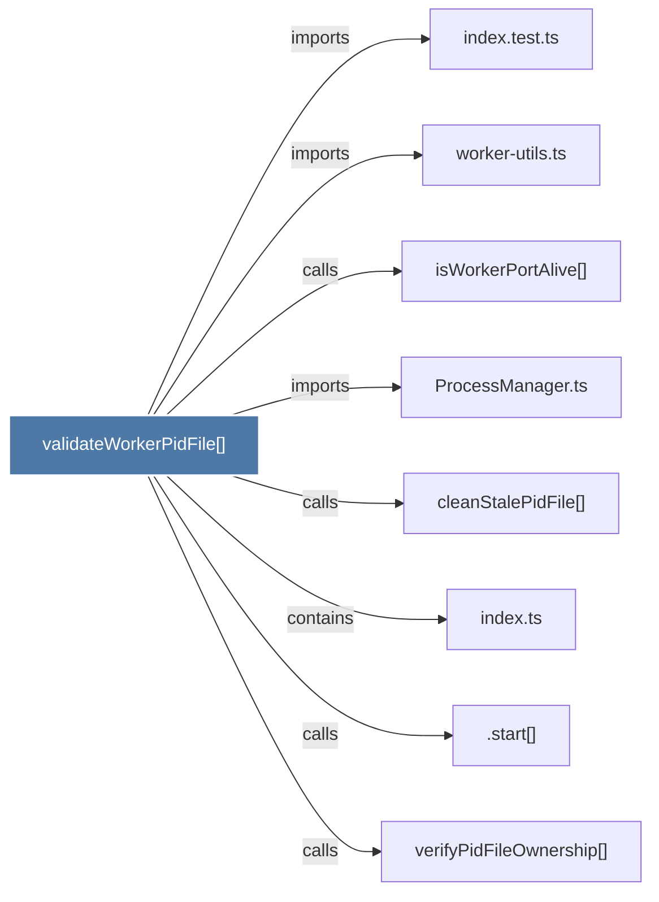

# validateWorkerPidFile()

> [!info] Properties
> **File Type**: code
> **Community**: [[_COMMUNITY_Community None|Community None]]
> **Degree**: 8

## Architecture Graph


## Outbound Connections
- [[.start()_3]] - `calls` [EXTRACTED]
- [[ProcessManager.ts]] - `imports` [EXTRACTED]
- [[cleanStalePidFile()]] - `calls` [INFERRED]
- [[index.test.ts]] - `imports` [EXTRACTED]
- [[index.ts_11]] - `contains` [EXTRACTED]
- [[isWorkerPortAlive()]] - `calls` [INFERRED]
- [[verifyPidFileOwnership()]] - `calls` [INFERRED]
- [[worker-utils.ts]] - `imports` [EXTRACTED]

## Inbound Dependencies
> [!abstract]- Files that link here
```dataview
LIST
FROM [[validateWorkerPidFile()]]
```

#graphify/code #graphify/EXTRACTED #community/Community_None