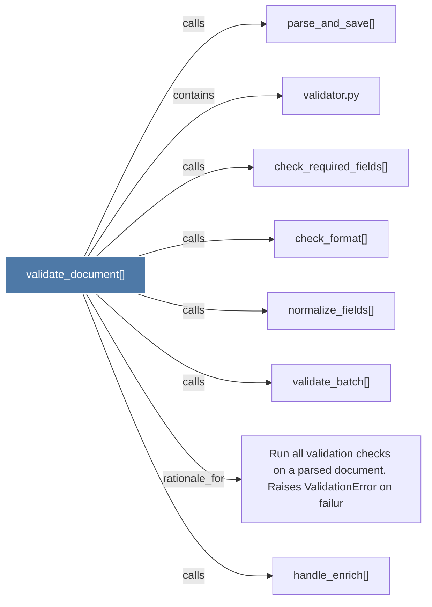

# validate_document()

> [!info] Properties
> **File Type**: code
> **Community**: [[_COMMUNITY_Community None|Community None]]
> **Degree**: 8

## Architecture Graph


## Outbound Connections
- [[Run all validation checks on a parsed document. Raises ValidationError on failur]] - `rationale_for` [EXTRACTED]
- [[check_format()]] - `calls` [EXTRACTED]
- [[check_required_fields()]] - `calls` [EXTRACTED]
- [[handle_enrich()]] - `calls` [INFERRED]
- [[normalize_fields()]] - `calls` [EXTRACTED]
- [[parse_and_save()]] - `calls` [INFERRED]
- [[validate_batch()]] - `calls` [EXTRACTED]
- [[validator.py]] - `contains` [EXTRACTED]

## Inbound Dependencies
> [!abstract]- Files that link here
```dataview
LIST
FROM [[validate_document()]]
```

#graphify/code #graphify/EXTRACTED #community/Community_None