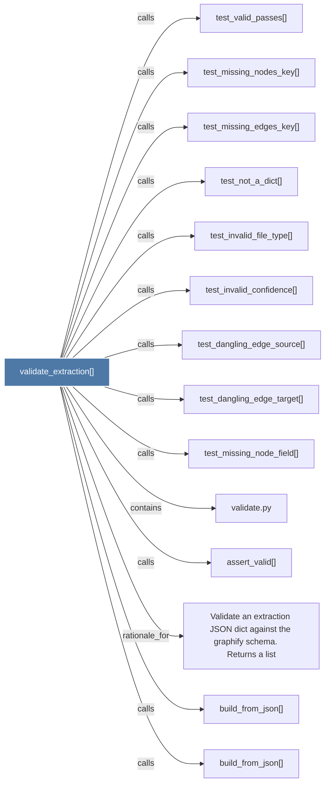

# validate_extraction()

> [!info] Properties
> **File Type**: code
> **Community**: [[_COMMUNITY_Community None|Community None]]
> **Degree**: 14

## Architecture Graph


## Outbound Connections
- [[Validate an extraction JSON dict against the graphify schema.     Returns a list]] - `rationale_for` [EXTRACTED]
- [[assert_valid()]] - `calls` [EXTRACTED]
- [[build_from_json()]] - `calls` [INFERRED]
- [[build_from_json()_1]] - `calls` [INFERRED]
- [[test_dangling_edge_source()]] - `calls` [INFERRED]
- [[test_dangling_edge_target()]] - `calls` [INFERRED]
- [[test_invalid_confidence()]] - `calls` [INFERRED]
- [[test_invalid_file_type()]] - `calls` [INFERRED]
- [[test_missing_edges_key()]] - `calls` [INFERRED]
- [[test_missing_node_field()]] - `calls` [INFERRED]
- [[test_missing_nodes_key()]] - `calls` [INFERRED]
- [[test_not_a_dict()]] - `calls` [INFERRED]
- [[test_valid_passes()]] - `calls` [INFERRED]
- [[validate.py]] - `contains` [EXTRACTED]

## Inbound Dependencies
> [!abstract]- Files that link here
```dataview
LIST
FROM [[validate_extraction()]]
```

#graphify/code #graphify/INFERRED #community/Community_None