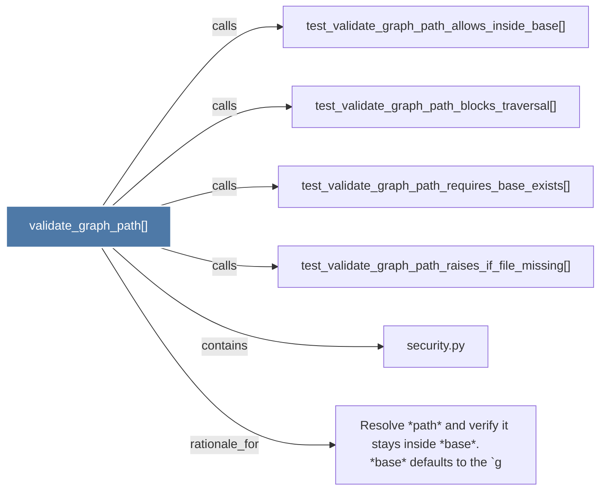

# validate_graph_path()

> [!info] Properties
> **File Type**: code
> **Community**: [[_COMMUNITY_Community None|Community None]]
> **Degree**: 6

## Architecture Graph


## Outbound Connections
- [[Resolve path and verify it stays inside base.      base defaults to the `g]] - `rationale_for` [EXTRACTED]
- [[security.py]] - `contains` [EXTRACTED]
- [[test_validate_graph_path_allows_inside_base()]] - `calls` [INFERRED]
- [[test_validate_graph_path_blocks_traversal()]] - `calls` [INFERRED]
- [[test_validate_graph_path_raises_if_file_missing()]] - `calls` [INFERRED]
- [[test_validate_graph_path_requires_base_exists()]] - `calls` [INFERRED]

## Inbound Dependencies
> [!abstract]- Files that link here
```dataview
LIST
FROM [[validate_graph_path()]]
```

#graphify/code #graphify/INFERRED #community/Community_None