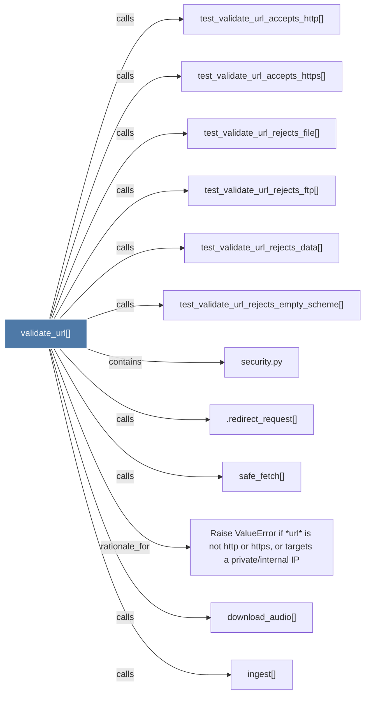

# validate_url()

> [!info] Properties
> **File Type**: code
> **Community**: [[_COMMUNITY_Community None|Community None]]
> **Degree**: 12

## Architecture Graph


## Outbound Connections
- [[.redirect_request()]] - `calls` [EXTRACTED]
- [[Raise ValueError if url is not http or https, or targets a privateinternal IP]] - `rationale_for` [EXTRACTED]
- [[download_audio()]] - `calls` [INFERRED]
- [[ingest()]] - `calls` [INFERRED]
- [[safe_fetch()]] - `calls` [EXTRACTED]
- [[security.py]] - `contains` [EXTRACTED]
- [[test_validate_url_accepts_http()]] - `calls` [INFERRED]
- [[test_validate_url_accepts_https()]] - `calls` [INFERRED]
- [[test_validate_url_rejects_data()]] - `calls` [INFERRED]
- [[test_validate_url_rejects_empty_scheme()]] - `calls` [INFERRED]
- [[test_validate_url_rejects_file()]] - `calls` [INFERRED]
- [[test_validate_url_rejects_ftp()]] - `calls` [INFERRED]

## Inbound Dependencies
> [!abstract]- Files that link here
```dataview
LIST
FROM [[validate_url()]]
```

#graphify/code #graphify/INFERRED #community/Community_None