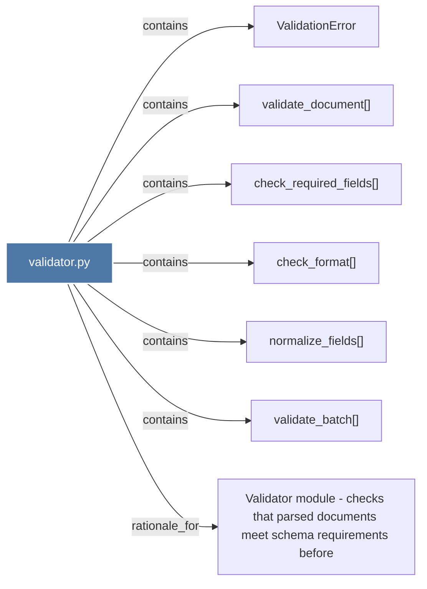

# validator.py

> [!info] Properties
> **File Type**: code
> **Community**: [[_COMMUNITY_Community None|Community None]]
> **Degree**: 7

## Architecture Graph


## Outbound Connections
- [[ValidationError]] - `contains` [EXTRACTED]
- [[Validator module - checks that parsed documents meet schema requirements before]] - `rationale_for` [EXTRACTED]
- [[check_format()]] - `contains` [EXTRACTED]
- [[check_required_fields()]] - `contains` [EXTRACTED]
- [[normalize_fields()]] - `contains` [EXTRACTED]
- [[validate_batch()]] - `contains` [EXTRACTED]
- [[validate_document()]] - `contains` [EXTRACTED]

## Inbound Dependencies
> [!abstract]- Files that link here
```dataview
LIST
FROM [[validator.py]]
```

#graphify/code #graphify/EXTRACTED #community/Community_None