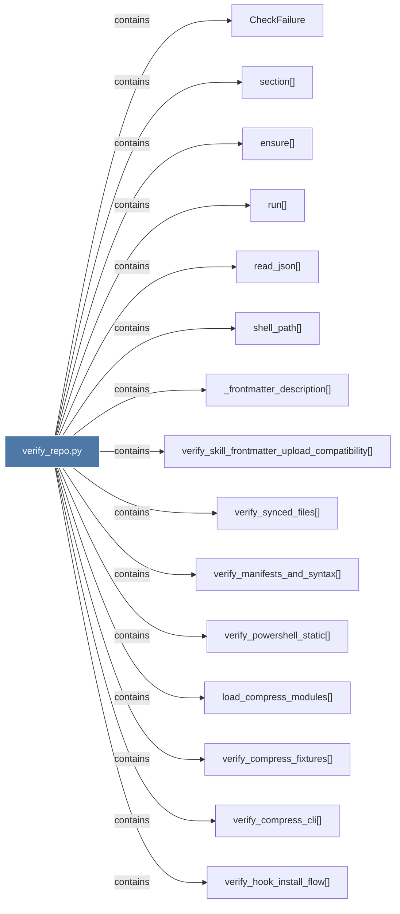

# verify_repo.py

> [!info] Properties
> **File Type**: code
> **Community**: [[_COMMUNITY_Community None|Community None]]
> **Degree**: 16

## Architecture Graph


## Outbound Connections
- [[CheckFailure]] - `contains` [EXTRACTED]
- [[_frontmatter_description()]] - `contains` [EXTRACTED]
- [[ensure()]] - `contains` [EXTRACTED]
- [[load_compress_modules()]] - `contains` [EXTRACTED]
- [[main()_10]] - `contains` [EXTRACTED]
- [[read_json()]] - `contains` [EXTRACTED]
- [[run()]] - `contains` [EXTRACTED]
- [[section()]] - `contains` [EXTRACTED]
- [[shell_path()]] - `contains` [EXTRACTED]
- [[verify_compress_cli()]] - `contains` [EXTRACTED]
- [[verify_compress_fixtures()]] - `contains` [EXTRACTED]
- [[verify_hook_install_flow()]] - `contains` [EXTRACTED]
- [[verify_manifests_and_syntax()]] - `contains` [EXTRACTED]
- [[verify_powershell_static()]] - `contains` [EXTRACTED]
- [[verify_skill_frontmatter_upload_compatibility()]] - `contains` [EXTRACTED]
- [[verify_synced_files()]] - `contains` [EXTRACTED]

## Inbound Dependencies
> [!abstract]- Files that link here
```dataview
LIST
FROM [[verify_repo.py]]
```

#graphify/code #graphify/EXTRACTED #community/Community_None