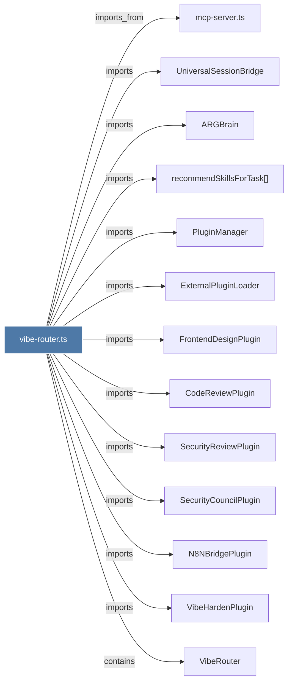

# vibe-router.ts

> [!info] Properties
> **File Type**: code
> **Community**: [[_COMMUNITY_Community None|Community None]]
> **Degree**: 13

## Architecture Graph


## Outbound Connections
- [[ARGBrain]] - `imports` [EXTRACTED]
- [[CodeReviewPlugin]] - `imports` [EXTRACTED]
- [[ExternalPluginLoader]] - `imports` [EXTRACTED]
- [[FrontendDesignPlugin]] - `imports` [EXTRACTED]
- [[N8NBridgePlugin]] - `imports` [EXTRACTED]
- [[PluginManager]] - `imports` [EXTRACTED]
- [[SecurityCouncilPlugin]] - `imports` [EXTRACTED]
- [[SecurityReviewPlugin]] - `imports` [EXTRACTED]
- [[UniversalSessionBridge]] - `imports` [EXTRACTED]
- [[VibeHardenPlugin]] - `imports` [EXTRACTED]
- [[VibeRouter]] - `contains` [EXTRACTED]
- [[mcp-server.ts_1]] - `imports_from` [EXTRACTED]
- [[recommendSkillsForTask()]] - `imports` [EXTRACTED]

## Inbound Dependencies
> [!abstract]- Files that link here
```dataview
LIST
FROM [[vibe-router.ts]]
```

#graphify/code #graphify/EXTRACTED #community/Community_None