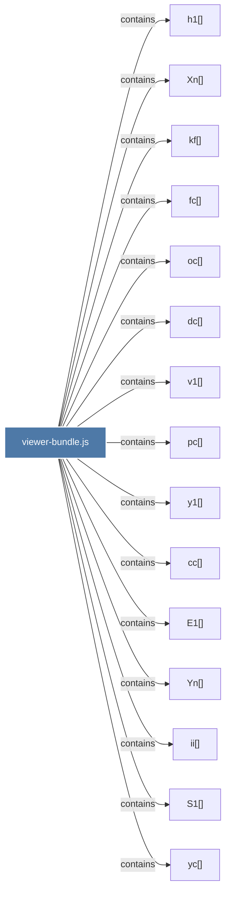

# viewer-bundle.js

> [!info] Properties
> **File Type**: code
> **Community**: [[_COMMUNITY_Community None|Community None]]
> **Degree**: 434

## Architecture Graph


## Outbound Connections
- [[$a()]] - `contains` [EXTRACTED]
- [[$c()]] - `contains` [EXTRACTED]
- [[$d()]] - `contains` [EXTRACTED]
- [[$l()]] - `contains` [EXTRACTED]
- [[$m()]] - `contains` [EXTRACTED]
- [[$t()]] - `contains` [EXTRACTED]
- [[$v()]] - `contains` [EXTRACTED]
- [[AE()]] - `contains` [EXTRACTED]
- [[Aa()]] - `contains` [EXTRACTED]
- [[An()]] - `contains` [EXTRACTED]
- [[Ar()]] - `contains` [EXTRACTED]
- [[Au()]] - `contains` [EXTRACTED]
- [[Av()]] - `contains` [EXTRACTED]
- [[Bd()]] - `contains` [EXTRACTED]
- [[Bh()]] - `contains` [EXTRACTED]
- [[Bm()]] - `contains` [EXTRACTED]
- [[Bu()]] - `contains` [EXTRACTED]
- [[C0()]] - `contains` [EXTRACTED]
- [[CE()]] - `contains` [EXTRACTED]
- [[Cm()]] - `contains` [EXTRACTED]
- [[Cn()]] - `contains` [EXTRACTED]
- [[Cr()]] - `contains` [EXTRACTED]
- [[Cs()]] - `contains` [EXTRACTED]
- [[Ct()]] - `contains` [EXTRACTED]
- [[Cv()]] - `contains` [EXTRACTED]
- [[Da()]] - `contains` [EXTRACTED]
- [[Dd()]] - `contains` [EXTRACTED]
- [[Dn()]] - `contains` [EXTRACTED]
- [[Do()]] - `contains` [EXTRACTED]
- [[Dr()]] - `contains` [EXTRACTED]
- [[Dv()]] - `contains` [EXTRACTED]
- [[E()]] - `contains` [EXTRACTED]
- [[E1()]] - `contains` [EXTRACTED]
- [[Ei()]] - `contains` [EXTRACTED]
- [[Em()]] - `contains` [EXTRACTED]
- [[Er()]] - `contains` [EXTRACTED]
- [[Es()]] - `contains` [EXTRACTED]
- [[Fd()]] - `contains` [EXTRACTED]
- [[Fm()]] - `contains` [EXTRACTED]
- [[Fv()]] - `contains` [EXTRACTED]
- [[Gc()]] - `contains` [EXTRACTED]
- [[Gd()]] - `contains` [EXTRACTED]
- [[Gh()]] - `contains` [EXTRACTED]
- [[Gm()]] - `contains` [EXTRACTED]
- [[Gp()]] - `contains` [EXTRACTED]
- [[Hh()]] - `contains` [EXTRACTED]
- [[Hm()]] - `contains` [EXTRACTED]
- [[Ho()]] - `contains` [EXTRACTED]
- [[Hp()]] - `contains` [EXTRACTED]
- [[Hr()]] - `contains` [EXTRACTED]
- [[Ia()]] - `contains` [EXTRACTED]
- [[Ic()]] - `contains` [EXTRACTED]
- [[Im()]] - `contains` [EXTRACTED]
- [[Ip()]] - `contains` [EXTRACTED]
- [[It()]] - `contains` [EXTRACTED]
- [[Iv()]] - `contains` [EXTRACTED]
- [[J0()]] - `contains` [EXTRACTED]
- [[Jd()]] - `contains` [EXTRACTED]
- [[Jg()]] - `contains` [EXTRACTED]
- [[Ji()]] - `contains` [EXTRACTED]
- [[Jn()]] - `contains` [EXTRACTED]
- [[Jo()]] - `contains` [EXTRACTED]
- [[Jv()]] - `contains` [EXTRACTED]
- [[K1()]] - `contains` [EXTRACTED]
- [[Kd()]] - `contains` [EXTRACTED]
- [[Kn()]] - `contains` [EXTRACTED]
- [[Ko()]] - `contains` [EXTRACTED]
- [[Kt()]] - `contains` [EXTRACTED]
- [[Kv()]] - `contains` [EXTRACTED]
- [[Li()]] - `contains` [EXTRACTED]
- [[Ll()]] - `contains` [EXTRACTED]
- [[Lm()]] - `contains` [EXTRACTED]
- [[Lo()]] - `contains` [EXTRACTED]
- [[Lv()]] - `contains` [EXTRACTED]
- [[M1()]] - `contains` [EXTRACTED]
- [[Ma()]] - `contains` [EXTRACTED]
- [[Mc()]] - `contains` [EXTRACTED]
- [[Mn()]] - `contains` [EXTRACTED]
- [[Mv()]] - `contains` [EXTRACTED]
- [[N1()]] - `contains` [EXTRACTED]
- [[Na()]] - `contains` [EXTRACTED]
- [[Nc()]] - `contains` [EXTRACTED]
- [[Nh()]] - `contains` [EXTRACTED]
- [[Ni()]] - `contains` [EXTRACTED]
- [[Nm()]] - `contains` [EXTRACTED]
- [[No()]] - `contains` [EXTRACTED]
- [[Nr()]] - `contains` [EXTRACTED]
- [[Nv()]] - `contains` [EXTRACTED]
- [[OE()]] - `contains` [EXTRACTED]
- [[Og()]] - `contains` [EXTRACTED]
- [[Om()]] - `contains` [EXTRACTED]
- [[Or()]] - `contains` [EXTRACTED]
- [[Ou()]] - `contains` [EXTRACTED]
- [[Pa()]] - `contains` [EXTRACTED]
- [[Pd()]] - `contains` [EXTRACTED]
- [[Pi()]] - `contains` [EXTRACTED]
- [[Pn()]] - `contains` [EXTRACTED]
- [[Pp()]] - `contains` [EXTRACTED]
- [[Pt()]] - `contains` [EXTRACTED]
- [[Pv()]] - `contains` [EXTRACTED]
- [[Qi()]] - `contains` [EXTRACTED]
- [[Ql()]] - `contains` [EXTRACTED]
- [[Qm()]] - `contains` [EXTRACTED]
- [[Qu()]] - `contains` [EXTRACTED]
- [[Qv()]] - `contains` [EXTRACTED]
- [[Rc()]] - `contains` [EXTRACTED]
- [[Rd()]] - `contains` [EXTRACTED]
- [[Re()]] - `contains` [EXTRACTED]
- [[Rl()]] - `contains` [EXTRACTED]
- [[Rr()]] - `contains` [EXTRACTED]
- [[Ru()]] - `contains` [EXTRACTED]
- [[Rv()]] - `contains` [EXTRACTED]
- [[S1()]] - `contains` [EXTRACTED]
- [[Sa()]] - `contains` [EXTRACTED]
- [[Sg()]] - `contains` [EXTRACTED]
- [[Sn()]] - `contains` [EXTRACTED]
- [[Sp()]] - `contains` [EXTRACTED]
- [[Ss()]] - `contains` [EXTRACTED]
- [[St()]] - `contains` [EXTRACTED]
- [[Su()]] - `contains` [EXTRACTED]
- [[Tc()]] - `contains` [EXTRACTED]
- [[Te()]] - `contains` [EXTRACTED]
- [[Ti()]] - `contains` [EXTRACTED]
- [[Tl()]] - `contains` [EXTRACTED]
- [[To()]] - `contains` [EXTRACTED]
- [[Tr()]] - `contains` [EXTRACTED]
- [[Tu()]] - `contains` [EXTRACTED]
- [[U1()]] - `contains` [EXTRACTED]
- [[Ud()]] - `contains` [EXTRACTED]
- [[Un()]] - `contains` [EXTRACTED]
- [[Uo()]] - `contains` [EXTRACTED]
- [[Uv()]] - `contains` [EXTRACTED]
- [[Uy()]] - `contains` [EXTRACTED]
- [[Vc()]] - `contains` [EXTRACTED]
- [[Ve()]] - `contains` [EXTRACTED]
- [[Vh()]] - `contains` [EXTRACTED]
- [[Vm()]] - `contains` [EXTRACTED]
- [[Vp()]] - `contains` [EXTRACTED]
- [[Vs()]] - `contains` [EXTRACTED]
- [[Vv()]] - `contains` [EXTRACTED]
- [[Vy()]] - `contains` [EXTRACTED]
- [[Wv()]] - `contains` [EXTRACTED]
- [[X1()]] - `contains` [EXTRACTED]
- [[XE()]] - `contains` [EXTRACTED]
- [[Xc()]] - `contains` [EXTRACTED]
- [[Xm()]] - `contains` [EXTRACTED]
- [[Xn()]] - `contains` [EXTRACTED]
- [[Xo()]] - `contains` [EXTRACTED]
- [[Xs()]] - `contains` [EXTRACTED]
- [[Xu()]] - `contains` [EXTRACTED]
- [[Ye()]] - `contains` [EXTRACTED]
- [[Yh()]] - `contains` [EXTRACTED]
- [[Yn()]] - `contains` [EXTRACTED]
- [[Yp()]] - `contains` [EXTRACTED]
- [[Yr()]] - `contains` [EXTRACTED]
- [[Yt()]] - `contains` [EXTRACTED]
- [[Yu()]] - `contains` [EXTRACTED]
- [[Yv()]] - `contains` [EXTRACTED]
- [[Z1()]] - `contains` [EXTRACTED]
- [[Zc()]] - `contains` [EXTRACTED]
- [[Zd()]] - `contains` [EXTRACTED]
- [[Zi()]] - `contains` [EXTRACTED]
- [[Zn()]] - `contains` [EXTRACTED]
- [[Zs()]] - `contains` [EXTRACTED]
- [[Zu()]] - `contains` [EXTRACTED]
- [[Zv()]] - `contains` [EXTRACTED]
- [[_g()]] - `contains` [EXTRACTED]
- [[_i()]] - `contains` [EXTRACTED]
- [[_o()]] - `contains` [EXTRACTED]
- [[_p()]] - `contains` [EXTRACTED]
- [[_r()]] - `contains` [EXTRACTED]
- [[_s()]] - `contains` [EXTRACTED]
- [[_y()]] - `contains` [EXTRACTED]
- [[a0()]] - `contains` [EXTRACTED]
- [[ad()]] - `contains` [EXTRACTED]
- [[ag()]] - `contains` [EXTRACTED]
- [[ah()]] - `contains` [EXTRACTED]
- [[ap()]] - `contains` [EXTRACTED]
- [[as()]] - `contains` [EXTRACTED]
- [[at()]] - `contains` [EXTRACTED]
- [[bE()]] - `contains` [EXTRACTED]
- [[bc()]] - `contains` [EXTRACTED]
- [[bg()]] - `contains` [EXTRACTED]
- [[bi()]] - `contains` [EXTRACTED]
- [[bl()]] - `contains` [EXTRACTED]
- [[bp()]] - `contains` [EXTRACTED]
- [[bs()]] - `contains` [EXTRACTED]
- [[by()]] - `contains` [EXTRACTED]
- [[ca()]] - `contains` [EXTRACTED]
- [[cc()]] - `contains` [EXTRACTED]
- [[cd()]] - `contains` [EXTRACTED]
- [[cf()]] - `contains` [EXTRACTED]
- [[cg()]] - `contains` [EXTRACTED]
- [[ch()]] - `contains` [EXTRACTED]
- [[ci()]] - `contains` [EXTRACTED]
- [[cl()]] - `contains` [EXTRACTED]
- [[co()]] - `contains` [EXTRACTED]
- [[componentDidCatch()_1]] - `contains` [EXTRACTED]
- [[constructor()_2]] - `contains` [EXTRACTED]
- [[cp()]] - `contains` [EXTRACTED]
- [[createHTML()]] - `contains` [EXTRACTED]
- [[createScriptURL()]] - `contains` [EXTRACTED]
- [[cy()]] - `contains` [EXTRACTED]
- [[d0()]] - `contains` [EXTRACTED]
- [[dE()]] - `contains` [EXTRACTED]
- [[dc()]] - `contains` [EXTRACTED]
- [[dg()]] - `contains` [EXTRACTED]
- [[dm()]] - `contains` [EXTRACTED]
- [[dp()]] - `contains` [EXTRACTED]
- [[ds()]] - `contains` [EXTRACTED]
- [[du()]] - `contains` [EXTRACTED]
- [[dy()]] - `contains` [EXTRACTED]
- [[e0()]] - `contains` [EXTRACTED]
- [[ed()]] - `contains` [EXTRACTED]
- [[ee()]] - `contains` [EXTRACTED]
- [[eg()]] - `contains` [EXTRACTED]
- [[ep()]] - `contains` [EXTRACTED]
- [[eu()]] - `contains` [EXTRACTED]
- [[ey()]] - `contains` [EXTRACTED]
- [[f0()]] - `contains` [EXTRACTED]
- [[fE()]] - `contains` [EXTRACTED]
- [[fc()]] - `contains` [EXTRACTED]
- [[ff()]] - `contains` [EXTRACTED]
- [[fg()]] - `contains` [EXTRACTED]
- [[fl()]] - `contains` [EXTRACTED]
- [[fo()]] - `contains` [EXTRACTED]
- [[fp()]] - `contains` [EXTRACTED]
- [[fs()]] - `contains` [EXTRACTED]
- [[ft()]] - `contains` [EXTRACTED]
- [[fy()]] - `contains` [EXTRACTED]
- [[g0()]] - `contains` [EXTRACTED]
- [[gE()]] - `contains` [EXTRACTED]
- [[ga()]] - `contains` [EXTRACTED]
- [[getDerivedStateFromError()_1]] - `contains` [EXTRACTED]
- [[gg()]] - `contains` [EXTRACTED]
- [[gi()]] - `contains` [EXTRACTED]
- [[gn()]] - `contains` [EXTRACTED]
- [[gr()]] - `contains` [EXTRACTED]
- [[gs()]] - `contains` [EXTRACTED]
- [[gt()]] - `contains` [EXTRACTED]
- [[gu()]] - `contains` [EXTRACTED]
- [[gy()]] - `contains` [EXTRACTED]
- [[h0()]] - `contains` [EXTRACTED]
- [[h1()]] - `contains` [EXTRACTED]
- [[hE()]] - `contains` [EXTRACTED]
- [[ha()]] - `contains` [EXTRACTED]
- [[hc()]] - `contains` [EXTRACTED]
- [[hd()]] - `contains` [EXTRACTED]
- [[hg()]] - `contains` [EXTRACTED]
- [[hi()]] - `contains` [EXTRACTED]
- [[hl()]] - `contains` [EXTRACTED]
- [[hn()]] - `contains` [EXTRACTED]
- [[hs()]] - `contains` [EXTRACTED]
- [[hu()]] - `contains` [EXTRACTED]
- [[hy()]] - `contains` [EXTRACTED]
- [[i0()]] - `contains` [EXTRACTED]
- [[id()]] - `contains` [EXTRACTED]
- [[ie()]] - `contains` [EXTRACTED]
- [[ig()]] - `contains` [EXTRACTED]
- [[ih()]] - `contains` [EXTRACTED]
- [[ii()]] - `contains` [EXTRACTED]
- [[il()]] - `contains` [EXTRACTED]
- [[io()]] - `contains` [EXTRACTED]
- [[ir()]] - `contains` [EXTRACTED]
- [[iu()]] - `contains` [EXTRACTED]
- [[iy()]] - `contains` [EXTRACTED]
- [[j()]] - `contains` [EXTRACTED]
- [[j1()]] - `contains` [EXTRACTED]
- [[jE()]] - `contains` [EXTRACTED]
- [[jh()]] - `contains` [EXTRACTED]
- [[jl()]] - `contains` [EXTRACTED]
- [[jm()]] - `contains` [EXTRACTED]
- [[jp()]] - `contains` [EXTRACTED]
- [[jr()]] - `contains` [EXTRACTED]
- [[js()]] - `contains` [EXTRACTED]
- [[jy()]] - `contains` [EXTRACTED]
- [[k()]] - `contains` [EXTRACTED]
- [[k0()]] - `contains` [EXTRACTED]
- [[kc()]] - `contains` [EXTRACTED]
- [[kf()]] - `contains` [EXTRACTED]
- [[kg()]] - `contains` [EXTRACTED]
- [[kh()]] - `contains` [EXTRACTED]
- [[ki()]] - `contains` [EXTRACTED]
- [[km()]] - `contains` [EXTRACTED]
- [[kp()]] - `contains` [EXTRACTED]
- [[ks()]] - `contains` [EXTRACTED]
- [[ku()]] - `contains` [EXTRACTED]
- [[ky()]] - `contains` [EXTRACTED]
- [[l0()]] - `contains` [EXTRACTED]
- [[ld()]] - `contains` [EXTRACTED]
- [[lg()]] - `contains` [EXTRACTED]
- [[lh()]] - `contains` [EXTRACTED]
- [[ln()]] - `contains` [EXTRACTED]
- [[lp()]] - `contains` [EXTRACTED]
- [[ls()]] - `contains` [EXTRACTED]
- [[ly()]] - `contains` [EXTRACTED]
- [[m0()]] - `contains` [EXTRACTED]
- [[mE()]] - `contains` [EXTRACTED]
- [[md()]] - `contains` [EXTRACTED]
- [[mg()]] - `contains` [EXTRACTED]
- [[mo()]] - `contains` [EXTRACTED]
- [[mp()]] - `contains` [EXTRACTED]
- [[mr()]] - `contains` [EXTRACTED]
- [[ms()]] - `contains` [EXTRACTED]
- [[mu()]] - `contains` [EXTRACTED]
- [[my()]] - `contains` [EXTRACTED]
- [[n0()]] - `contains` [EXTRACTED]
- [[nE()]] - `contains` [EXTRACTED]
- [[nd()]] - `contains` [EXTRACTED]
- [[ng()]] - `contains` [EXTRACTED]
- [[np()]] - `contains` [EXTRACTED]
- [[ns()]] - `contains` [EXTRACTED]
- [[nt()]] - `contains` [EXTRACTED]
- [[ny()]] - `contains` [EXTRACTED]
- [[o0()]] - `contains` [EXTRACTED]
- [[oa()]] - `contains` [EXTRACTED]
- [[oc()]] - `contains` [EXTRACTED]
- [[od()]] - `contains` [EXTRACTED]
- [[oh()]] - `contains` [EXTRACTED]
- [[oi()]] - `contains` [EXTRACTED]
- [[ol()]] - `contains` [EXTRACTED]
- [[op()]] - `contains` [EXTRACTED]
- [[os()]] - `contains` [EXTRACTED]
- [[ot()]] - `contains` [EXTRACTED]
- [[oy()]] - `contains` [EXTRACTED]
- [[p0()]] - `contains` [EXTRACTED]
- [[pE()]] - `contains` [EXTRACTED]
- [[pc()]] - `contains` [EXTRACTED]
- [[pg()]] - `contains` [EXTRACTED]
- [[pl()]] - `contains` [EXTRACTED]
- [[pm()]] - `contains` [EXTRACTED]
- [[po()]] - `contains` [EXTRACTED]
- [[pr()]] - `contains` [EXTRACTED]
- [[ps()]] - `contains` [EXTRACTED]
- [[pu()]] - `contains` [EXTRACTED]
- [[py()]] - `contains` [EXTRACTED]
- [[q0()]] - `contains` [EXTRACTED]
- [[qa()]] - `contains` [EXTRACTED]
- [[qc()]] - `contains` [EXTRACTED]
- [[qd()]] - `contains` [EXTRACTED]
- [[qe()]] - `contains` [EXTRACTED]
- [[qg()]] - `contains` [EXTRACTED]
- [[qh()]] - `contains` [EXTRACTED]
- [[qo()]] - `contains` [EXTRACTED]
- [[qp()]] - `contains` [EXTRACTED]
- [[qs()]] - `contains` [EXTRACTED]
- [[qt()]] - `contains` [EXTRACTED]
- [[qy()]] - `contains` [EXTRACTED]
- [[r0()]] - `contains` [EXTRACTED]
- [[ra()]] - `contains` [EXTRACTED]
- [[render()]] - `contains` [EXTRACTED]
- [[rg()]] - `contains` [EXTRACTED]
- [[rh()]] - `contains` [EXTRACTED]
- [[ri()]] - `contains` [EXTRACTED]
- [[rm()]] - `contains` [EXTRACTED]
- [[rp()]] - `contains` [EXTRACTED]
- [[rs()]] - `contains` [EXTRACTED]
- [[rt()]] - `contains` [EXTRACTED]
- [[ry()]] - `contains` [EXTRACTED]
- [[s0()]] - `contains` [EXTRACTED]
- [[sd()]] - `contains` [EXTRACTED]
- [[se()]] - `contains` [EXTRACTED]
- [[sf()]] - `contains` [EXTRACTED]
- [[si()]] - `contains` [EXTRACTED]
- [[sl()]] - `contains` [EXTRACTED]
- [[sm()]] - `contains` [EXTRACTED]
- [[sv()]] - `contains` [EXTRACTED]
- [[sy()]] - `contains` [EXTRACTED]
- [[t0()]] - `contains` [EXTRACTED]
- [[td()]] - `contains` [EXTRACTED]
- [[tg()]] - `contains` [EXTRACTED]
- [[th()]] - `contains` [EXTRACTED]
- [[tm()]] - `contains` [EXTRACTED]
- [[tp()]] - `contains` [EXTRACTED]
- [[ts()]] - `contains` [EXTRACTED]
- [[ty()]] - `contains` [EXTRACTED]
- [[u0()]] - `contains` [EXTRACTED]
- [[ug()]] - `contains` [EXTRACTED]
- [[uh()]] - `contains` [EXTRACTED]
- [[um()]] - `contains` [EXTRACTED]
- [[up()]] - `contains` [EXTRACTED]
- [[ur()]] - `contains` [EXTRACTED]
- [[us()]] - `contains` [EXTRACTED]
- [[uu()]] - `contains` [EXTRACTED]
- [[v0()]] - `contains` [EXTRACTED]
- [[v1()]] - `contains` [EXTRACTED]
- [[va()]] - `contains` [EXTRACTED]
- [[vd()]] - `contains` [EXTRACTED]
- [[vg()]] - `contains` [EXTRACTED]
- [[vl()]] - `contains` [EXTRACTED]
- [[vn()]] - `contains` [EXTRACTED]
- [[vu()]] - `contains` [EXTRACTED]
- [[w0()]] - `contains` [EXTRACTED]
- [[wc()]] - `contains` [EXTRACTED]
- [[wg()]] - `contains` [EXTRACTED]
- [[wh()]] - `contains` [EXTRACTED]
- [[wi()]] - `contains` [EXTRACTED]
- [[wl()]] - `contains` [EXTRACTED]
- [[wm()]] - `contains` [EXTRACTED]
- [[wo()]] - `contains` [EXTRACTED]
- [[wp()]] - `contains` [EXTRACTED]
- [[ws()]] - `contains` [EXTRACTED]
- [[wu()]] - `contains` [EXTRACTED]
- [[wy()]] - `contains` [EXTRACTED]
- [[x0()]] - `contains` [EXTRACTED]
- [[xa()]] - `contains` [EXTRACTED]
- [[xd()]] - `contains` [EXTRACTED]
- [[xg()]] - `contains` [EXTRACTED]
- [[xh()]] - `contains` [EXTRACTED]
- [[xi()]] - `contains` [EXTRACTED]
- [[xp()]] - `contains` [EXTRACTED]
- [[xr()]] - `contains` [EXTRACTED]
- [[xt()]] - `contains` [EXTRACTED]
- [[xv()]] - `contains` [EXTRACTED]
- [[xy()]] - `contains` [EXTRACTED]
- [[y0()]] - `contains` [EXTRACTED]
- [[y1()]] - `contains` [EXTRACTED]
- [[yc()]] - `contains` [EXTRACTED]
- [[yd()]] - `contains` [EXTRACTED]
- [[yg()]] - `contains` [EXTRACTED]
- [[ym()]] - `contains` [EXTRACTED]
- [[ys()]] - `contains` [EXTRACTED]
- [[yy()]] - `contains` [EXTRACTED]
- [[z0()]] - `contains` [EXTRACTED]
- [[za()]] - `contains` [EXTRACTED]
- [[zg()]] - `contains` [EXTRACTED]
- [[zh()]] - `contains` [EXTRACTED]
- [[zl()]] - `contains` [EXTRACTED]
- [[zm()]] - `contains` [EXTRACTED]
- [[zo()]] - `contains` [EXTRACTED]
- [[zp()]] - `contains` [EXTRACTED]
- [[zr()]] - `contains` [EXTRACTED]
- [[zt()]] - `contains` [EXTRACTED]
- [[zy()]] - `contains` [EXTRACTED]

## Inbound Dependencies
> [!abstract]- Files that link here
```dataview
LIST
FROM [[viewer-bundle.js]]
```

#graphify/code #graphify/EXTRACTED #community/Community_None