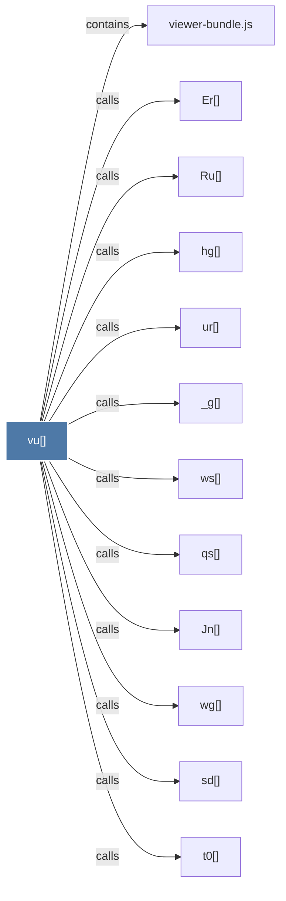

# vu()

> [!info] Properties
> **File Type**: code
> **Community**: [[_COMMUNITY_Community None|Community None]]
> **Degree**: 12

## Architecture Graph


## Outbound Connections
- [[Er()]] - `calls` [EXTRACTED]
- [[Jn()]] - `calls` [EXTRACTED]
- [[Ru()]] - `calls` [EXTRACTED]
- [[_g()]] - `calls` [EXTRACTED]
- [[hg()]] - `calls` [EXTRACTED]
- [[qs()]] - `calls` [EXTRACTED]
- [[sd()]] - `calls` [EXTRACTED]
- [[t0()]] - `calls` [EXTRACTED]
- [[ur()]] - `calls` [EXTRACTED]
- [[viewer-bundle.js]] - `contains` [EXTRACTED]
- [[wg()]] - `calls` [EXTRACTED]
- [[ws()]] - `calls` [EXTRACTED]

## Inbound Dependencies
> [!abstract]- Files that link here
```dataview
LIST
FROM [[vu()]]
```

#graphify/code #graphify/EXTRACTED #community/Community_None