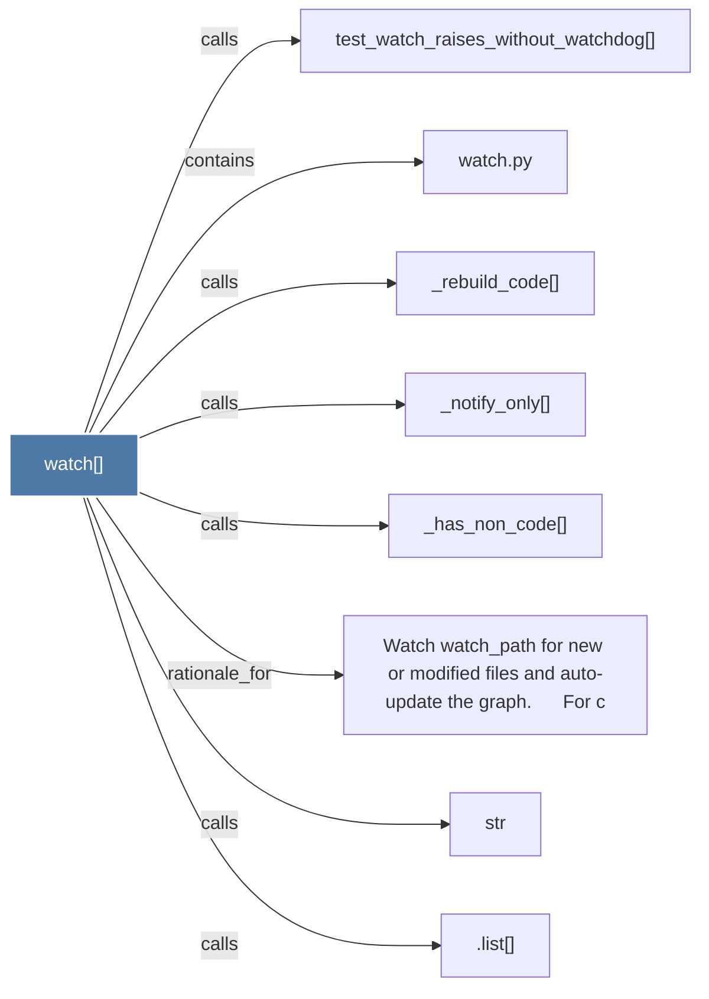

# watch()

> [!info] Properties
> **File Type**: code
> **Community**: [[_COMMUNITY_Community None|Community None]]
> **Degree**: 8

## Architecture Graph


## Outbound Connections
- [[.list()]] - `calls` [INFERRED]
- [[Watch watch_path for new or modified files and auto-update the graph.      For c]] - `rationale_for` [EXTRACTED]
- [[_has_non_code()]] - `calls` [EXTRACTED]
- [[_notify_only()]] - `calls` [EXTRACTED]
- [[_rebuild_code()]] - `calls` [EXTRACTED]
- [[str]] - `calls` [INFERRED]
- [[test_watch_raises_without_watchdog()]] - `calls` [INFERRED]
- [[watch.py]] - `contains` [EXTRACTED]

## Inbound Dependencies
> [!abstract]- Files that link here
```dataview
LIST
FROM [[watch()]]
```

#graphify/code #graphify/EXTRACTED #community/Community_None