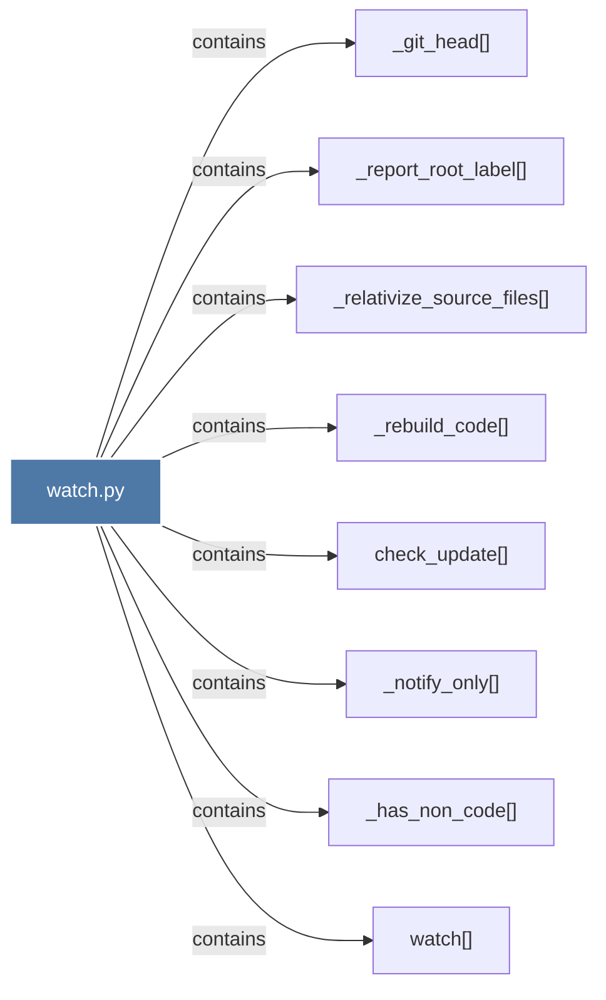

# watch.py

> [!info] Properties
> **File Type**: code
> **Community**: [[_COMMUNITY_Community None|Community None]]
> **Degree**: 8

## Architecture Graph


## Outbound Connections
- [[_git_head()_1]] - `contains` [EXTRACTED]
- [[_has_non_code()]] - `contains` [EXTRACTED]
- [[_notify_only()]] - `contains` [EXTRACTED]
- [[_rebuild_code()]] - `contains` [EXTRACTED]
- [[_relativize_source_files()]] - `contains` [EXTRACTED]
- [[_report_root_label()]] - `contains` [EXTRACTED]
- [[check_update()]] - `contains` [EXTRACTED]
- [[watch()]] - `contains` [EXTRACTED]

## Inbound Dependencies
> [!abstract]- Files that link here
```dataview
LIST
FROM [[watch.py]]
```

#graphify/code #graphify/EXTRACTED #community/Community_None