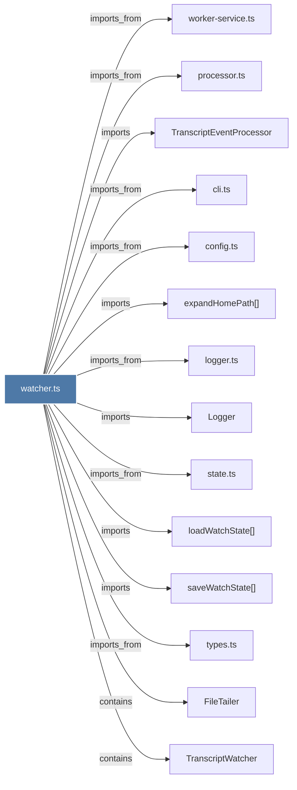

# watcher.ts

> [!info] Properties
> **File Type**: code
> **Community**: [[_COMMUNITY_Community None|Community None]]
> **Degree**: 14

## Architecture Graph


## Outbound Connections
- [[FileTailer]] - `contains` [EXTRACTED]
- [[Logger]] - `imports` [EXTRACTED]
- [[TranscriptEventProcessor]] - `imports` [EXTRACTED]
- [[TranscriptWatcher]] - `contains` [EXTRACTED]
- [[cli.ts]] - `imports_from` [EXTRACTED]
- [[config.ts]] - `imports_from` [EXTRACTED]
- [[expandHomePath()]] - `imports` [EXTRACTED]
- [[loadWatchState()]] - `imports` [EXTRACTED]
- [[logger.ts]] - `imports_from` [EXTRACTED]
- [[processor.ts]] - `imports_from` [EXTRACTED]
- [[saveWatchState()]] - `imports` [EXTRACTED]
- [[state.ts]] - `imports_from` [EXTRACTED]
- [[types.ts_4]] - `imports_from` [EXTRACTED]
- [[worker-service.ts]] - `imports_from` [EXTRACTED]

## Inbound Dependencies
> [!abstract]- Files that link here
```dataview
LIST
FROM [[watcher.ts]]
```

#graphify/code #graphify/EXTRACTED #community/Community_None