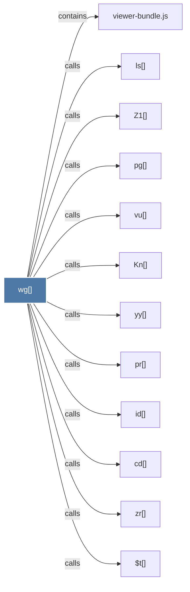

# wg()

> [!info] Properties
> **File Type**: code
> **Community**: [[_COMMUNITY_Community None|Community None]]
> **Degree**: 12

## Architecture Graph


## Outbound Connections
- [[$t()]] - `calls` [EXTRACTED]
- [[Kn()]] - `calls` [EXTRACTED]
- [[Z1()]] - `calls` [EXTRACTED]
- [[cd()]] - `calls` [EXTRACTED]
- [[id()]] - `calls` [EXTRACTED]
- [[ls()]] - `calls` [EXTRACTED]
- [[pg()]] - `calls` [EXTRACTED]
- [[pr()]] - `calls` [EXTRACTED]
- [[viewer-bundle.js]] - `contains` [EXTRACTED]
- [[vu()]] - `calls` [EXTRACTED]
- [[yy()]] - `calls` [EXTRACTED]
- [[zr()]] - `calls` [EXTRACTED]

## Inbound Dependencies
> [!abstract]- Files that link here
```dataview
LIST
FROM [[wg()]]
```

#graphify/code #graphify/EXTRACTED #community/Community_None